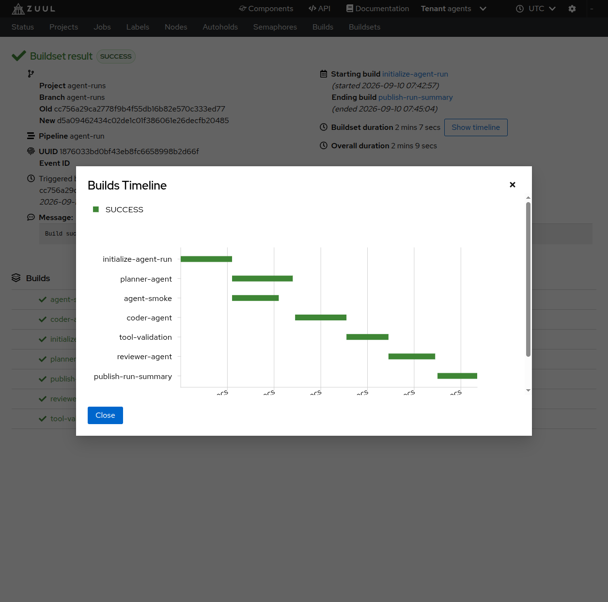
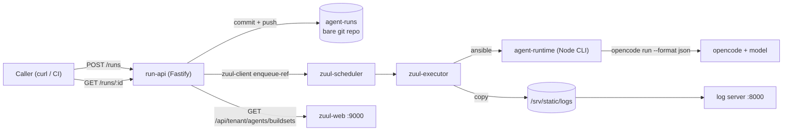
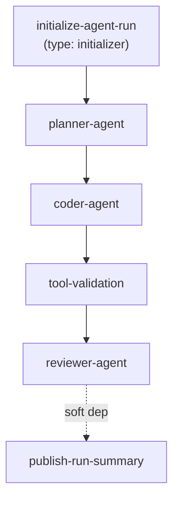

# Zuul Agentic Workflow

**A local, Git-backed AI agent pipeline orchestrated by [Zuul](https://zuul-ci.org/)** — a manual/API task flows through a `planner → coder → reviewer` agent chain, gated at every step by deterministic (non-model) validation, producing a traceable Zuul buildset with a structured run summary, logs, and a real patch artifact.

No Gerrit. No mocked E2E tests. Every phase is proven live against a real Zuul stack and a real model.



<sub>A dry-run (`"mock": true`, zero model cost) buildset timeline: `initialize-agent-run → planner-agent → coder-agent → tool-validation → reviewer-agent → publish-run-summary`, all `SUCCESS`.</sub>

## Contents

- [What this proves](#what-this-proves)
- [Architecture](#architecture)
- [Quickstart](#quickstart)
- [Repository layout](#repository-layout)
- [Development](#development)
- [Status](#status)
- [Documentation](#documentation)
- [License](#license)

## What this proves

1. A `POST /runs` HTTP call can drive a real Zuul buildset end to end, with **zero manual git plumbing** for the caller.
2. Every agent role (`planner`, `coder`, `reviewer`) invokes the real `opencode` CLI through a thin, fully-tested Node runtime — never a raw shell-out from a playbook.
3. **Deterministic validation is the sole gate.** `tool-validation` (schema, patch application, allowlist, secret scan, lint, tests) decides pass/fail — never a model's self-assessment. The reviewer's opinion is recorded but is purely advisory.
4. Six hardening scenarios prove specific failure modes are bounded and explicit: malformed output, an invalid model name, a patch that can't apply, a patch that breaks tests, and a workspace-escape attempt — each fails at a precise, predictable point, never silently or open-endedly.
5. The whole run is legible to a human in the Zuul web UI, not just via API calls.

## Architecture





Full design rationale, every architectural decision, and the research behind
each one live in [`docs/PLAN.md`](docs/PLAN.md).

## Quickstart

```bash
git clone <this-repo> && cd zuul-agentic-workflow
npm install && npm run build

make phase0-up && make phase0-seed   # bring up Zuul (pinned 14.2.0) + seed repos
make phase5-run-api                  # start the Run API on :4100

curl -s -X POST http://localhost:4100/runs -H 'Content-Type: application/json' -d '{
  "task": "Add a one-line comment above the add function in index.js explaining what it does.",
  "repo": "sandbox/services/example",
  "base_ref": "main",
  "mock": true
}'
# {"run_id":"01ARZ3ND...","newrev":"...","status_url":"/runs/01ARZ3ND..."}

curl -s http://localhost:4100/runs/<run_id> | python3 -m json.tool
```

`"mock": true` runs the exact same job graph at zero model cost (a recorded
fixture replaces the real `opencode` call). Drop it for a real run.

See **[`docs/RUNBOOK.md`](docs/RUNBOOK.md)** for the full operational
walkthrough: submitting runs, reading a `run-summary.md`, running the
hardening scenarios, `make demo`, and troubleshooting.

## Repository layout

```
.
├── apps/run-api/            # Fastify HTTP server: POST /runs, GET /runs/:id, ...
├── packages/
│   ├── agent-contracts/     # JSON Schemas (single source of truth) + generated TS types
│   ├── agent-runtime/       # Node CLI wrapping `opencode run` for planner/coder/reviewer
│   └── agent-tools/         # Deterministic patch validation (9 ordered checks)
├── prompts/                 # planner.md / coder.md / reviewer.md role templates
├── sandbox/services/example/ # tiny target repo the coder patches
├── zuul/                    # docker-compose stack, tenant/pipeline/job config, playbooks
├── docs/
│   ├── PLAN.md               # the full implementation plan + research + decisions
│   └── RUNBOOK.md            # operational quick-start
└── .playwright-mcp/          # committed UI evidence screenshots
```

## Development

npm workspaces, TypeScript strict mode, Vitest, Ajv-validated JSON Schemas.

```bash
make install    # npm install
make build      # tsc -b across every package/app
make test       # unit + integration tests — never costs a model call
make lint       # eslint + prettier
make format     # prettier --write
```

Zuul stack + Run API:

```bash
make phase0-up / phase0-seed / phase0-down / phase0-clean   # bring the stack up/down
make check-config                                            # sanity: semaphore name matches everywhere
make phase1-reload                                            # push zuul-config changes + reload the scheduler
make phase5-run-api / phase5-run-api-stop                     # start/stop the Run API
```

Live E2E gates (each **costs real model tokens** — deliberately never mocked,
per this repo's testing philosophy):

```bash
make e2e-2   # agent-runtime, real opencode call
make e2e-3   # planner -> coder state passing
make e2e-4   # coder produces a real, validated patch
make e2e-5   # the full 6-job chain via POST /runs (headline gate)
make e2e-6-1 … e2e-6-6   # the six hardening scenarios, individually
make e2e-6   # all six in sequence, with a pass/fail summary
make demo    # scripted happy-path run + a readable transcript
make e2e     # every Live E2E gate, in order
```

Zero-cost equivalents exist for the gates that need one (`phase3-e2e-mock`,
`phase4-e2e-mock`, `phase5-e2e-mock`) — same job graph, `agent-runtime --mock`
instead of a real model call.

## Status

| Phase | What it delivers                                  | Status                                                                                                                                                                                                                                         |
| ----- | ------------------------------------------------- | ---------------------------------------------------------------------------------------------------------------------------------------------------------------------------------------------------------------------------------------------- |
| 0     | Zuul infra spike (single `git` driver, no Gerrit) | ✅                                                                                                                                                                                                                                             |
| 1     | Pipeline baseline + `type: initializer`           | ✅                                                                                                                                                                                                                                             |
| 2     | Contracts + `agent-runtime` CLI + `git-writer`    | ✅                                                                                                                                                                                                                                             |
| 3     | Planner → coder state passing                     | ✅                                                                                                                                                                                                                                             |
| 4     | Deterministic patch validation (`agent-tools`)    | ✅                                                                                                                                                                                                                                             |
| 5     | Reviewer + run summary + Run API (headline gate)  | ✅                                                                                                                                                                                                                                             |
| 6     | Hardening scenarios + demo + RUNBOOK              | ✅ implemented — 1/6 scenarios live-verified this session (see [`docs/PLAN.md`](docs/PLAN.md) §11 Phase 6 for the full incident writeup: an external model-provider rate limit, not a code defect, blocked completing the remaining live runs) |

## Documentation

- [`docs/PLAN.md`](docs/PLAN.md) — the complete implementation plan: every
  research finding, architectural decision, deviation, and phase-by-phase
  gate result
- [`docs/RUNBOOK.md`](docs/RUNBOOK.md) — operational quick-start
- [`zuul/README.md`](zuul/README.md) — Zuul stack internals and
  troubleshooting history

## License

TBD
