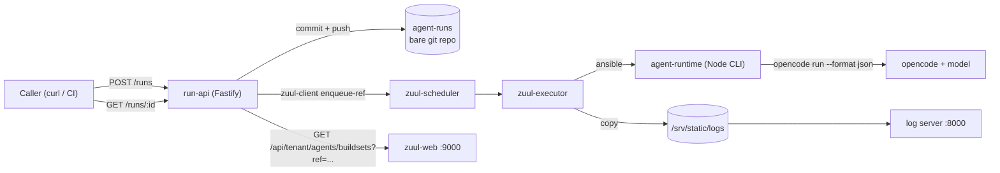
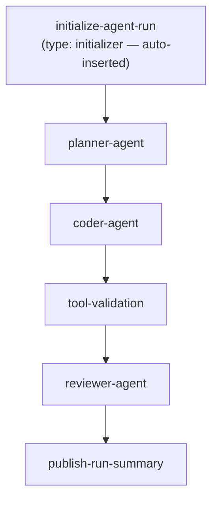

# Implementation Plan — Zuul Agentic Workflow PoC

Status: **Phases 0-5 complete. Phase 6 implemented; live-verification
partially blocked by an external model-provider rate limit (see §11 Phase 6
and §14 Definition of Done) — re-run `make e2e-6` once resolved to close
the PoC's final two open Definition-of-Done items.**
Last verified against live sources: **2026-09-10**.
Source of requirements: [docs/INITIAL.md](INITIAL.md).

---

## 0. Executive summary

We will build a local, Git-backed agent pipeline orchestrated by Zuul:

```
Run API (HTTP) → commit to agent-runs repo → zuul-client enqueue-ref
  → initialize-agent-run (type: initializer)
  → planner-agent → coder-agent → tool-validation → reviewer-agent
  → run-summary artifacts
```

Each Zuul job is a thin Ansible playbook that shells out to a single Node CLI
(`agent-runtime`). All agent logic lives in Node. All truth lives in
deterministic validation, never in a model's self-assessment.

**Six phases plus a Phase 0 confirmation spike**, each ending in a binary,
independently reproducible acceptance gate. All six open architectural
questions this plan originally carried are now **resolved by research** — see
§13. Phase 0 is reduced to confirming those findings against a live stack.

Three hard constraints shape everything below:

1. **No Gerrit, ever.** Enqueue is done with `zuul-client enqueue-ref` against
   a single `git` driver connection that hosts both the config-project and the
   untrusted project — **confirmed supported by source inspection** (§13/Q1),
   no fallback needed.
2. **Non-mocked Live E2E is a gate at every milestone from Phase 2 onward** —
   real Zuul, real containers, real model — not just a final demo. §10 defines
   the tiers; §11 assigns `E2E-0` … `E2E-6`.
3. **The Zuul web UI is a deliverable.** The run must be legible to a human in
   the browser, verified by me via Playwright at Phases 1, 5 and 6, with
   committed screenshots (§11.7).

---

## 1. Research findings that change the original design

This section records what the research actually established, including where
[docs/INITIAL.md](INITIAL.md) is wrong or under-specified. Every claim below is
cited.

### 1.1 Versions (verified 2026-09-09)

| Component | Version | Evidence |
|---|---|---|
| Zuul | **14.2.0** (2026-04-29) | `https://pypi.org/pypi/zuul/json`; docs version switcher |
| zuul-client | **14.0.0** (2026-02-26) | `https://pypi.org/project/zuul-client/`; `zuul-client --version` on host |
| opencode | **1.18.29** | `opencode --version` on host |
| Node.js | **24.15.0** | `node --version` on host |
| Docker / Compose | **29.7.2 / v5.5.0** | `docker --version`, `docker compose version` |
| Ansible | **core 2.16.3** | `ansible --version` on host |

Zuul release cadence is fast (13.0.0 → 14.2.0 in ~8 months). **Pin container
image tags explicitly** (`quay.io/zuul-ci/zuul-scheduler:14.2.0`), never
`latest`. The official example compose file uses unpinned images; we deviate
deliberately.

### 1.2 `type: initializer` is REAL — but the plan's job graph is wrong

INITIAL.md declares `initialize-agent-run` with `type: initializer` and shows it
as an explicit first node in the graph. Research confirms:

- ✅ `job.type` with value `initializer` **is implemented** since **Zuul 13.1.0**
  (release notes: *"A new type of job, an 'initializer' job is available… The
  configuration attribute, `job.type` is available to enable the feature."*).
  Reference: `https://zuul-ci.org/docs/zuul/latest/config/job.html`.
- ⚠️ The spec page `developer/specs/init-jobs.html` still carries a **stale**
  banner claiming the feature is "not currently available in Zuul". Ignore it;
  `config/job.html` is authoritative.
- ❗ **Semantics correction:** an initializer job is *"always automatically
  inserted at the start of the job graph… and acts as a dependency for all other
  jobs in the graph."* It must therefore **not** be listed in the project
  stanza's job list, and `planner-agent` must **not** declare a dependency on it.
  INITIAL.md's implied wiring is redundant at best.
  **CORRECTION (Phase 1, empirically disproven):** the job graph is built from
  the project stanza's job list ("any initializer jobs that it *encounters*"
  per the dev spec) - an `initialize-agent-run` job that exists in
  `zuul.d/jobs.yaml` but is absent from `zuul.d/projects.yaml`'s `jobs:` list
  **never runs at all**. It DOES need to be listed there, exactly like a
  regular job; what "auto-inserted as a dependency" actually buys you is that
  you don't need to add an explicit `dependencies: [initialize-agent-run]` to
  every other job - Zuul does that wiring for you once the initializer is
  present in the list. Verified via `zuul/scripts/e2e-1.sh` (Phase 1): the job
  was silently never scheduled with the old (incorrect) understanding, and
  started running the moment it was added to `projects.yaml`.
- ✅ Valid `job.type` values are exactly `regular`, `initializer`, `reporter`.
  `finalizer` does **not** exist.
- 💡 An initializer job may return `zuul.child_jobs` to prune the graph. If
  multiple initializers return `child_jobs`, Zuul runs the **intersection**.
  This is our mechanism for fail-fast on an invalid run request.

### 1.3 Parent → child state passing is NOT namespaced

INITIAL.md says "dependent jobs use only the returned summary plus artifact
references". The mechanism is real but sharper than described:

- Data returned via `zuul_return: data: {...}` outside the `zuul:` key becomes
  **flat Ansible variables** in dependent jobs.
- ❗ There is **no per-parent-job dictionary** (`zuul.parent_data` does not
  exist). All parents merge into one global namespace.
- ❗ Parent job results have the **LOWEST precedence** of any Zuul variable
  type — below job vars, project vars, extra-vars, etc.
- ❗ *"If more than one parent job returns the same variable, the value from the
  later job in the job graph will take precedence."*

**Design consequence:** every returned variable MUST be uniquely prefixed by
role. We will return a single namespaced object per role:

```yaml
- zuul_return:
    data:
      agent_result_planner:
        role: planner
        status: success
        summary: "..."
        artifact_url: "https://logs.../planner/agent-result.json"
        confidence: 0.82
```

Never a bare `summary:` or `status:`. A collision here is silent and would be a
very hard bug to find.

### 1.4 Artifact passing via `zuul.artifacts` — RESOLVED (§13/Q2: confirmed NOT populated via `dependencies`)

- `zuul_return` → `zuul.artifacts` is fully documented and stored in the SQL DB,
  shown in the web UI. Multiple calls **append**.
- `config/job.html` states dependent jobs are *"provided with artifacts returned
  by preceding jobs"*, transitively — but only in the `requires`/`provides`
  mechanism.
- ✅ **CONFIRMED (§13/Q2):** `zuul.artifacts` is populated **only** via
  `requires`/`provides` matching, not via plain `job.dependencies`. Only
  non-`zuul`-namespaced return data is documented as propagated to
  `dependencies`-linked children.

**Design consequence (defence in depth):** we pass the artifact URL **both**
ways — as `zuul.artifacts` (for the UI and for future `provides`/`requires`
work) **and** inside our namespaced `agent_result_<role>` data variable, which
uses a fully documented mechanism. The runtime reads the namespaced variable.
Phase 0 includes a spike to determine whether `zuul.artifacts` is in fact
populated; if it is, we keep both but document the finding.

### 1.5 Semaphore footgun

- `job.semaphore` (singular) is **deprecated**; use `semaphores`.
- ❗ An **undefined** semaphore name does not error — Zuul silently creates an
  **implicit semaphore with `max: 1`**. A typo therefore serialises the whole
  pipeline instead of failing loudly.
- ❗ `semaphores` **cannot be reduced** by inheritance or override-control; the
  list only ever extends.
- Global semaphores are declared in the **tenant config** via
  `- global-semaphore:` and granted per tenant via `tenant.semaphores`.

**Design consequence:** define `agent-model-concurrency` as a **global
semaphore** (matching INITIAL.md's intent) and add a startup assertion in the
Makefile that greps the tenant config for the exact name used in jobs.

### 1.6 `cleanup-run` is deprecated

Use `post-run` with `cleanup: true`. Cleanup playbooks have a **hard-coded
five-minute timeout**.

### 1.7 Timeouts are phase-scoped

- `timeout` covers **pre-run + run only**.
- `post-timeout` applies **per post playbook**.
- `pre-timeout` (Zuul 12.0.0+) bounds pre-run separately.
- `attempts` (default **3**) retries **only pre-run failures**. Run-phase errors
  are reported immediately. `zuul_return: zuul: {retry: false}` disables it.

**Design consequence:** the model call happens in the **run** phase, so Zuul's
`attempts` will **not** retry a flaky model call. Retry logic must live in the
Node runtime. This is consistent with INITIAL.md's "model-call retry policy in
the Node runtime" but the reason is now explicit.

### 1.8 Enqueue without a code-review system — RESOLVED

INITIAL.md assumes the Run API can "create a change… then enqueue it". Research
(final, see §13 for the resolution record):

- ✅ `zuul-client enqueue-ref --tenant T --pipeline P --project X --ref refs/heads/agent-runs --oldrev OLD --newrev NEW`
  submits a trigger event **with no code-review system**, no change number, no
  patchset. Documented under "Manual enqueue examples".
- ✅ `enqueue` (change-based) requires `--change <number>,<patchset>` and
  therefore requires Gerrit/GitHub/GitLab. **Not used.**
- ✅ The `git` driver **can** load Zuul configuration from Git repos and **can**
  trigger on `ref-updated`.
- ✅ **CONFIRMED (§13/Q1):** the `git` driver **can** host a config-project —
  `zuul/configloader.py` sets `trusted=True/False` purely from which YAML list a
  repo appears under; there is no driver-type restriction. Source:
  `TenantParser.loadTenantProjects`, zuul 14.2.0.
- ❗ **CONFIRMED BROKEN (§13/Q3):** `enqueue-ref` with `oldrev` = all-zeros
  (branch-creation marker) **fails** against the git driver for `refs/heads/*` —
  `git diff 0000...0..<sha>` is not a valid revision range, and the merger job
  raises, which the scheduler surfaces as `ValueError('Unknown change')`.
  **Design changed accordingly: see below.**
- ✅ **CONFIRMED (§13/Q4):** the git driver's poll (`git ls-remote --heads --tags`)
  is a cheap ref-advertisement query with no clone/fetch. `poll_delay=60` is
  safe and decoupled from `enqueue-ref` latency.
- ⚠️ Both `enqueue` and `enqueue-ref` are **privileged** — they require a JWT
  (§1.9, unaffected by the above).

**Decision: `enqueue-ref` + single `git` driver connection hosting both
`zuul-config` (config-project) and `agent-runs` (untrusted-project). Gerrit is
EXCLUDED — hard constraint, permanent, no fallback needed.**

The official quickstart uses Gerrit (~1 GB image, slow start, interactive
account setup, SSH key provisioning). It is disproportionate for a PoC that
explicitly performs no code review, and it does not fit this host's 7.3 GB RAM
alongside the rest of the stack. Gerrit will not be introduced at any phase —
and, per §13/Q1, it was never actually needed as a fallback in the first place.

**Ref strategy (revised from the original "one ref per run" scheme):** because
zero-`oldrev` branch creation is broken, the Run API uses a **single, permanent
branch** `refs/heads/agent-runs`, created once at repo-init time
(`git commit --allow-empty` + push) and never deleted. Each run appends a commit
containing `runs/<run_id>/request.json` and fast-forwards that branch, so every
`enqueue-ref` call uses **real, non-zero** `oldrev`/`newrev`. The initializer
disambiguates the triggering run via
`git diff-tree --no-commit-id --name-only -r {{ zuul.newrev }}`. Because all
runs share one branch, the Run API's git-writer **must serialize pushes**
(tracked as R14, a new required Phase 1 task) to avoid non-fast-forward races
under concurrent `POST /runs`.

### 1.9 Auth for enqueue — exact configuration

```ini
[auth zuul_operator]
driver=HS256
allow_authz_override=true
realm=zuul.example.com
client_id=zuul.example.com
issuer_id=zuul_operator
secret=exampleSecret
```

Mint a token inside the scheduler container:

```bash
docker compose exec scheduler \
  zuul-admin create-auth-token \
    --auth-config zuul_operator \
    --user run-api \
    --tenant agents \
    --expires-in 86400
```

Notes:
- Output **includes the literal `Bearer ` prefix** — strip it before passing to
  `zuul-client --auth-token`.
- `--auth-config` must match the INI section name exactly. The docs example
  spells `zuul-operator` (hyphen) while the argparse default is `zuul_operator`
  (underscore); we standardise on **underscore**.
- Because `allow_authz_override=true` and the token carries a `zuul.admin`
  claim for tenant `agents`, **no tenant `admin-rules` are required**. This
  avoids the deprecated `admin-rules` / `access-rules` keys entirely (they are
  slated for removal in favour of `tenant.role-mappings`).

### 1.10 Node labels use the new "Nodepool-in-Zuul" model

Zuul 14 replaces standalone Nodepool with `zuul-launcher` and in-repo
`image` / `flavor` / `label` / `section` / `provider` objects. The official
example (`zuul-config/zuul.d/providers.yaml`) defines a static node thus:

```yaml
- image:  {name: ubuntu-jammy, type: cloud}
- flavor: {name: static}
- label:  {name: ubuntu-jammy, image: ubuntu-jammy, flavor: static}
- section:
    name: static
    connection: static
    flavors: [{name: static}]
- provider:
    name: static-main
    section: static
    nodes:
      - name: node
        label: ubuntu-jammy
        connection-port: 22
        host-key: "ssh-ed25519 AAAA..."
    labels: [{name: ubuntu-jammy}]
    images:
      - name: ubuntu-jammy
        python-path: /usr/bin/python3
        username: root
```

INITIAL.md's `label: agent-runner` therefore requires a full
image/flavor/label/section/provider set plus a matching `[connection static]`
in `zuul.conf` and a `launcher` service in compose. This is **significant
unstated work**.

**Alternative considered and adopted for Phase 1–2:** run agent jobs as
**executor-only jobs** (no `nodeset`), which use Ansible's implicit localhost
and require **no launcher, no static node container, no SSH keys**. Playbooks
must then use `- hosts: localhost`. We introduce the real `agent-runner` node
only in Phase 4, when we need a genuinely isolated workspace.

⚠️ Executor-only jobs run **on the Zuul executor**, inside a bubblewrap jail.
This is acceptable for a local PoC but is explicitly **not** an isolation
boundary we would ship. Recorded as a known limitation.

### 1.11 `opencode run` output format — VERIFIED BY EXPERIMENT

Ran on this host, 2026-09-09:

```bash
opencode run --format json --model 'opencode/big-pickle' 'Reply with exactly: PONG'
```

Exit code `0`. stdout is **NDJSON — one JSON object per line**, not a single
JSON document:

```
{"type":"step_start","timestamp":...,"sessionID":"ses_...","part":{...}}
{"type":"text","timestamp":...,"part":{"type":"text","text":"PONG","time":{...}}}
{"type":"step_finish","timestamp":...,"part":{"reason":"stop","tokens":{"total":22781,"input":22764,"output":17,"reasoning":0,"cache":{...}},"cost":0}}
```

Confirmed facts:
- Assistant text arrives in `type: "text"` events under `part.text`; there may
  be **multiple** such events which must be **concatenated in order**.
- `step_finish` carries `part.tokens` and `part.cost` — free telemetry for the
  run summary.
- stderr was empty on success; `--print-logs` sends logs to stderr.

Relevant flags confirmed from `opencode run --help`:

| Flag | Use |
|---|---|
| `--format json` | NDJSON event stream (**required**) |
| `-m, --model` | `provider/model`, e.g. `opencode/big-pickle` |
| `--dir` | run in a specific directory (workspace confinement) |
| `--agent` | select an agent definition |
| `--variant` | reasoning effort |
| `--print-logs`, `--log-level` | diagnostics to stderr |
| `--pure` | run **without external plugins** |
| `--auto` | auto-approve permissions — **dangerous, do not use** |

**Design consequences:**
1. The runtime must parse NDJSON line-by-line and tolerate non-JSON lines.
2. Use `--pure` to eliminate plugin nondeterminism.
3. Never use `--auto`.
4. `opencode` writes session state into the working directory; always pass an
   explicit `--dir` pointing at the ephemeral workspace.

### 1.12 Logs and artifacts in a local deployment

The official example provides the pattern:
- executor mounts a shared volume at `/srv/static/logs`;
- `zuul.conf` sets `[executor] trusted_rw_paths=/srv/static/logs`;
- a small Apache container (`logs-Dockerfile`) serves that volume on `:8000`;
- the base job's `post-run` playbook copies logs there and calls
  `zuul_return` with `zuul.log_url`.

We adopt this verbatim. Artifact URLs returned via `zuul_return` may be
**relative** — Zuul combines them with `zuul.log_url`. This keeps our playbooks
free of hardcoded hostnames.

### 1.13 REST API for the Run API's status endpoint

| Purpose | Endpoint |
|---|---|
| List buildsets | `GET /api/tenant/{tenant}/buildsets` |
| **Buildset detail (builds + artifacts)** | `GET /api/tenant/{tenant}/buildset/{uuid}` |
| List builds | `GET /api/tenant/{tenant}/builds` |
| Build detail | `GET /api/tenant/{tenant}/build/{uuid}` |
| Enqueue (REST) | `POST /api/tenant/{tenant}/project/{project}/enqueue` |

`/buildsets` supports `?ref=&newrev=&limit=` — this is how the Run API maps a
`run_id` back to a buildset. **Revised per §13/Q3:** all runs share the single
branch `refs/heads/agent-runs`; the Run API queries by the **`newrev`** of the
commit it just pushed for that run (recorded at push time), not by a per-run
ref name.

⚠️ The REST `enqueue` body schema documents only
`{pipeline, ref, oldrev, newrev, parameters}`. We use the `zuul-client` CLI
rather than raw REST, because its behaviour is documented and stable.

---

## 2. Architecture

### 2.1 Component diagram



### 2.2 Job graph (corrected)



The initializer is **not** listed in the project stanza. It validates the run
request and may emit `zuul.child_jobs: []` to skip everything downstream.

### 2.3 Trust boundaries

| Zone | Contents | Trust |
|---|---|---|
| Config project `zuul-config` | pipelines, providers, base job, job defs | **Trusted** |
| Untrusted project `agent-runs` | run-request commits | **Untrusted data** |
| Model output | prompts, stdout, patches, summaries | **Hostile until validated** |
| `tool-validation` | schema, patch apply, allowlist, lint, tests, secret scan | **Sole source of truth** |

Rule: **the reviewer's verdict is advisory and never gates progression** in this
PoC.

---

## 3. Repository layout (final)

```
.
├── Makefile                          # see §11.8 for the full target list
├── package.json                      # npm workspaces root
├── tsconfig.base.json
├── apps/
│   └── run-api/
│       ├── src/{server,routes,git-writer,zuul-client,status}.ts
│       └── test/
├── packages/
│   ├── agent-contracts/              # schemas + generated TS types
│   │   ├── schemas/*.json            # single source of truth
│   │   └── src/index.ts
│   ├── agent-runtime/
│   │   └── src/{cli,input,prompt,opencode,normalize,retry,redact}.ts
│   └── agent-tools/
│       └── src/{patch,allowlist,lint,test,secrets,summary}.ts
├── prompts/{planner,coder,reviewer}.md
├── schemas/                          # symlink → packages/agent-contracts/schemas
├── sandbox/
│   └── services/example/             # target repo the coder patches
├── zuul/
│   ├── docker-compose.yaml
│   ├── etc_zuul/{zuul.conf,main.yaml}
│   ├── zuul-config/zuul.d/{pipelines,providers,jobs,projects}.yaml
│   ├── jobs/agent-jobs.yaml
│   └── playbooks/
│       ├── base/{pre,post-logs,cleanup}.yaml
│       ├── init-run.yaml
│       ├── run-agent.yaml
│       ├── validate-result.yaml
│       └── publish-summary.yaml
├── .playwright-mcp/                  # committed UI evidence screenshots
└── docs/{INITIAL.md,PLAN.md,poc.md,RUNBOOK.md}
```

`schemas/` at the root (as INITIAL.md specifies) is a **symlink** into
`agent-contracts` so there is exactly one source of truth. DRY over layout
fidelity.

---

## 4. Contracts

Schemas are **JSON Schema draft 2020-12**, validated with **Ajv** using the
`ajv/dist/2020` entry point. TypeScript types are **generated** from the
schemas (`json-schema-to-typescript`) — never hand-written in parallel.

### 4.1 `task-request.schema.json`

```jsonc
{
  "$schema": "https://json-schema.org/draft/2020-12/schema",
  "$id": "https://zuul-agentic/task-request.schema.json",
  "type": "object",
  "additionalProperties": false,
  "required": ["task", "repo", "base_ref"],
  "properties": {
    "task":   { "type": "string", "minLength": 8, "maxLength": 4000 },
    "repo":   { "type": "string", "pattern": "^[a-z0-9][a-z0-9._/-]{0,127}$" },
    "base_ref": { "type": "string", "pattern": "^[A-Za-z0-9._/-]{1,128}$" },
    "model":  { "type": "string", "pattern": "^[a-z0-9-]+/[a-z0-9._-]+$" },
    "allowed_paths": {
      "type": "array", "items": { "type": "string" },
      "maxItems": 64, "default": []
    }
  }
}
```

`run_id` and `requested_at` are **server-assigned**, never client-supplied.
`run_id` is a **ULID** (lexicographically sortable, matches INITIAL.md's `01...`
example).

### 4.2 `agent-input.schema.json`

```jsonc
{
  "$schema": "https://json-schema.org/draft/2020-12/schema",
  "$id": "https://zuul-agentic/agent-input.schema.json",
  "type": "object",
  "additionalProperties": false,
  "required": ["schema_version","run_id","role","task","workspace","model"],
  "properties": {
    "schema_version": { "const": 1 },
    "run_id": { "type": "string", "pattern": "^[0-9A-HJKMNP-TV-Z]{26}$" },
    "role":   { "enum": ["planner","coder","reviewer"] },
    "task": {
      "type": "object", "additionalProperties": false,
      "required": ["description","repo","base_ref"],
      "properties": {
        "description": { "type": "string" },
        "repo":        { "type": "string" },
        "base_ref":    { "type": "string" },
        "base_sha":    { "type": "string", "pattern": "^[0-9a-f]{40}$" }
      }
    },
    "upstream_results": {
      "type": "array", "default": [],
      "items": {
        "type": "object", "additionalProperties": false,
        "required": ["role","summary"],
        "properties": {
          "role":         { "enum": ["planner","coder","reviewer","validation"] },
          "summary":      { "type": "string", "maxLength": 8000 },
          "artifact_url": { "type": "string", "format": "uri" },
          "status":       { "enum": ["success","failure","error"] }
        }
      }
    },
    "validation": { "type": ["object","null"], "default": null },
    "workspace": {
      "type": "object", "additionalProperties": false,
      "required": ["path","mode"],
      "properties": {
        "path": { "type": "string" },
        "mode": { "enum": ["read-only","read-write"] }
      }
    },
    "model": { "type": "string" },
    "limits": {
      "type": "object",
      "properties": {
        "timeout_ms":       { "type": "integer", "default": 900000 },
        "max_output_bytes": { "type": "integer", "default": 1048576 },
        "max_attempts":     { "type": "integer", "default": 3 }
      }
    }
  }
}
```

Note the additions over INITIAL.md: `schema_version`, `base_sha` (pins the
revision the patch must apply to — required for deterministic validation),
`validation` (feeds the reviewer), and `limits`.

### 4.3 `agent-result.schema.json`

```jsonc
{
  "$schema": "https://json-schema.org/draft/2020-12/schema",
  "$id": "https://zuul-agentic/agent-result.schema.json",
  "type": "object",
  "additionalProperties": false,
  "required": ["schema_version","run_id","agent","status","summary"],
  "properties": {
    "schema_version": { "const": 1 },
    "run_id":  { "type": "string" },
    "agent":   { "enum": ["planner","coder","reviewer"] },
    "status":  { "enum": ["success","failure","error"] },
    "summary": { "type": "string", "minLength": 1, "maxLength": 8000 },
    "claims": {
      "type": "array", "default": [],
      "items": {
        "type": "object", "additionalProperties": false,
        "required": ["statement","verifiable"],
        "properties": {
          "statement":  { "type": "string" },
          "verifiable": { "type": "boolean" },
          "evidence":   { "type": "string" }
        }
      }
    },
    "files":        { "type": "array", "items": { "type": "string" }, "default": [] },
    "next_actions": { "type": "array", "items": { "type": "string" }, "default": [] },
    "confidence":   { "type": "number", "minimum": 0, "maximum": 1 },
    "state_uri":    { "type": "string" },
    "telemetry": {
      "type": "object",
      "properties": {
        "model":        { "type": "string" },
        "attempts":     { "type": "integer" },
        "duration_ms":  { "type": "integer" },
        "tokens_input": { "type": "integer" },
        "tokens_output":{ "type": "integer" },
        "cost":         { "type": "number" }
      }
    }
  }
}
```

`telemetry` is populated from the `step_finish` NDJSON event — free, verified
data. `claims[].verifiable` forces the model to distinguish assertions it can
back with evidence from ones it cannot; `tool-validation` cross-checks these.

### 4.4 `run-summary.schema.json` (new — INITIAL.md names the file but omits it)

Aggregates: run request, per-role results, validation report, buildset UUID,
build URLs, artifact URLs, final verdict, total cost/tokens.

---

## 5. Node runtime design

### 5.1 Stack

| Concern | Choice | Rationale |
|---|---|---|
| Package layout | npm **workspaces** | built in to npm 11; no extra tool (KISS) |
| Language | **TypeScript**, strict, `noUncheckedIndexedAccess` | AGENTS.md forbids `any` |
| Validation | **Ajv** (2020-12 build) | de-facto standard, fastest |
| Types | `json-schema-to-typescript` | schemas stay single source of truth |
| HTTP | **Fastify** | schema-first, built-in JSON Schema validation |
| Tests | **Vitest** | fast, native TS/ESM |
| Subprocess | `node:child_process.spawn` | zero deps; `execa` adds nothing we need |
| Logging | structured JSON to stderr | keeps stdout clean for machine output |

Exact minor versions are pinned by `package-lock.json` at install time; this
document deliberately does not fabricate version numbers it has not verified.

### 5.2 CLI contract (as specified in INITIAL.md)

```bash
agent-runtime run \
  --role planner \
  --input  /tmp/agent-input.json \
  --output /tmp/agent-result.json \
  --prompt prompts/planner.md \
  --model  "${AGENT_MODEL}" \
  [--mock] [--workspace /workspace] [--artifacts /tmp/artifacts]
```

Exit codes — **explicit and bounded**, per AGENTS.md:

| Code | Meaning |
|---|---|
| `0` | success; valid result written |
| `10` | input manifest failed schema validation |
| `11` | prompt file missing/unreadable |
| `20` | model invocation failed after all retries |
| `21` | model call exceeded timeout |
| `22` | model output exceeded size cap |
| `30` | model output could not be normalised into a valid result (**fail closed**) |
| `40` | workspace violation (write attempted outside allowed root) |

### 5.3 Execution pipeline

1. **Load & validate input** against `agent-input.schema.json` → exit `10`.
2. **Compose prompt**: role template + task + upstream summaries + validation
   report + a strict *"emit a single fenced ```json block matching this
   schema"* instruction. The result schema is **embedded in the prompt**.
3. **Invoke opencode**:
   ```
   opencode run --format json --pure --model <model> --dir <workspace> <prompt>
   ```
   - prompt passed via argv (or a temp file for large prompts);
   - stdout and stderr captured **separately** into distinct buffers;
   - hard `timeout_ms` via `AbortController`, then `SIGTERM` → `SIGKILL`;
   - byte counter aborts at `max_output_bytes` → exit `22`.
4. **Parse NDJSON**: split on newlines, `JSON.parse` each, ignore unparseable
   lines (recording a warning), concatenate `part.text` from `type: "text"`
   events in order, extract `part.tokens`/`part.cost` from `step_finish`.
5. **Normalise**: extract the last fenced ```json block; parse; fill defaults;
   validate against `agent-result.schema.json`. Failure → **exit 30, no partial
   result written**.
6. **Retry policy**: retry only on transport/timeout/malformed-output classes,
   `max_attempts` (default 3), exponential backoff with jitter
   (1s, 2s, 4s ±20%). Each attempt logged with its own telemetry. Never retry
   a schema-valid `status: failure` — that is a real answer.
7. **Redact**: apply secret patterns to result, stdout log, and stderr log
   before writing.
8. **Write atomically**: write to `<output>.tmp`, `fsync`, `rename`.

### 5.4 Mock mode

`--mock` short-circuits step 3, replaying a fixture keyed by role from
`packages/agent-runtime/fixtures/`. Fixtures deliberately include:
`valid`, `malformed-json`, `missing-required-field`, `empty-output`,
`oversized-output`, `timeout`, `nonzero-exit`.

This makes the entire Zuul pipeline runnable **with zero model cost** — essential
for iterating on Ansible and for CI.

### 5.5 Workspace confinement

- `--dir` restricts opencode's working directory.
- After the run, the runtime **diffs the workspace against `base_sha`** and
  rejects any change touching a path outside `allowed_paths` → exit `40`.
- The runtime never invokes `git push`, and no push credentials exist in the
  job environment (Definition of Done: *"no target-repo write occurs"*).

---

## 6. Deterministic validation (`agent-tools`)

`tool-validation` is a **regular job** running `validate-result.yaml`, which
invokes `agent-tools validate`. Ordered, fail-fast checks:

| # | Check | Failure = |
|---|---|---|
| 1 | Every `agent-result.json` validates against schema | FAILURE |
| 2 | `patch.diff` is non-empty and parses as a unified diff | FAILURE |
| 3 | `git apply --check` against the recorded `base_sha` | FAILURE |
| 4 | Changed-file allowlist (from `allowed_paths` + repo default) | FAILURE |
| 5 | Forbidden paths (`.git/`, `**/*.pem`, `**/.env*`, CI config, `zuul/`) | FAILURE |
| 6 | Secret scan (regex set) over patch **and** all artifacts | FAILURE |
| 7 | Formatter/linter on the patched tree | FAILURE |
| 8 | Focused test command on the patched tree | FAILURE |
| 9 | Cross-check `claims[].verifiable == true` against evidence | WARNING |

Output: `validation-report.json` (machine) + `validation-report.md` (human),
both published as artifacts and both fed to the reviewer.

Critically: **step 3 applies the patch to a throwaway clone inside the job
workspace.** The sandbox target repo (`sandbox/services/example`) is never
mutated in place.

---

## 7. Zuul configuration

### 7.1 Compose services (pinned)

| Service | Image | Port | Notes |
|---|---|---|---|
| `zk` | `quay.io/opendevmirror/zookeeper` | — | TLS certs via init playbook |
| `mysql` | `quay.io/opendevmirror/mariadb` | — | build/artifact history |
| `scheduler` | `quay.io/zuul-ci/zuul-scheduler:14.2.0` | — | |
| `web` | `quay.io/zuul-ci/zuul-web:14.2.0` | `9000` | REST API + UI |
| `executor` | `quay.io/zuul-ci/zuul-executor:14.2.0` | — | `privileged: true` |
| `logs` | local Apache build | `8000` | serves `/srv/static/logs` |
| `gitserver` | `nginx` + `git-http-backend` | `8081` | hosts `agent-runs` + `zuul-config` |
| `launcher` | `quay.io/zuul-ci/zuul-launcher:14.2.0` | — | **Phase 4 only** |

**Gerrit is never present, in any phase.** `node` and `launcher` are additionally
omitted in Phases 0–3 — a deliberate simplification enabled by executor-only
jobs (§1.10) and `enqueue-ref` (§1.8).

Resource note: the host has 7.3 GB RAM (≈4.8 GB available). ZooKeeper + MariaDB
+ 3 Zuul services + nginx + Apache is comfortable; Gerrit would not be. The
Gerrit-free design is both an architectural and a capacity decision.

The Zuul **web UI is a first-class deliverable**, not incidental: `web` on
`:9000` is how a human inspects the buildset, the job graph, per-build console
output and the artifact list. §7.7 and §11.7 cover its configuration and
verification.

### 7.2 `zuul.conf` (deltas from the official example)

```ini
[scheduler]
tenant_config=/etc/zuul/main.yaml

[connection agent-git]
driver=git
baseurl=http://gitserver/git
poll_delay=60

[executor]
trusted_rw_paths=/srv/static/logs
# Pass the model name through to job environments
variables=/etc/zuul/site-variables.yaml

[auth zuul_operator]
driver=HS256
allow_authz_override=true
realm=zuul.local
client_id=zuul.local
issuer_id=zuul_operator
secret=${ZUUL_AUTH_SECRET}
```

`AGENT_MODEL` is supplied as a **site variable**, not baked into job definitions
— satisfying INITIAL.md's *"The model name is configuration, not hardcoded into
job definitions."*

### 7.3 `main.yaml` (tenant)

```yaml
- global-semaphore:
    name: agent-model-concurrency
    max: 2

- tenant:
    name: agents
    semaphores:
      - agent-model-concurrency
    source:
      agent-git:
        config-projects:
          - zuul-config          # ⚠ Phase 0 must confirm git-driver config-projects
        untrusted-projects:
          - agent-runs
```

### 7.4 Pipeline

```yaml
- pipeline:
    name: agent-run
    description: Executes an agent workflow for a submitted run request.
    manager: independent
    trigger:
      agent-git:
        - event: ref-updated
          ref: ^refs/heads/agent-runs$
```

`independent` because runs are unrelated to each other and must not queue behind
one another. Concurrency is bounded by the semaphore, not the pipeline. The
trigger matches the **single shared branch** (§1.8/§13-Q3); the initializer job
identifies which run's commit fired the event via `zuul.newrev`.

### 7.5 Jobs (corrected from INITIAL.md)

```yaml
- job:
    name: agent
    abstract: true
    timeout: 1800
    pre-timeout: 300
    post-timeout: 300
    attempts: 1                     # model retries live in the Node runtime
    run: zuul/playbooks/run-agent.yaml
    semaphores:
      - name: agent-model-concurrency
    vars:
      agent_input_path:  /tmp/agent-input.json
      agent_output_path: /tmp/agent-result.json
      agent_artifacts_dir: "{{ zuul.executor.log_root }}/artifacts"

- job:
    name: initialize-agent-run
    type: initializer                       # auto-inserted; NOT listed in project
    run: zuul/playbooks/init-run.yaml

- job: {name: planner-agent,  parent: agent, vars: {agent_role: planner,  prompt_file: prompts/planner.md}}
- job: {name: coder-agent,    parent: agent, vars: {agent_role: coder,    prompt_file: prompts/coder.md}}
- job: {name: reviewer-agent, parent: agent, vars: {agent_role: reviewer, prompt_file: prompts/reviewer.md}}

- job:
    name: tool-validation
    timeout: 900
    run: zuul/playbooks/validate-result.yaml

- job:
    name: publish-run-summary
    timeout: 300
    run: zuul/playbooks/publish-summary.yaml

- project:
    name: agent-runs
    agent-run:
      jobs:
        - planner-agent
        - coder-agent:      {dependencies: [planner-agent]}
        - tool-validation:  {dependencies: [coder-agent]}
        - reviewer-agent:   {dependencies: [tool-validation]}
        - publish-run-summary:
            dependencies:
              - name: reviewer-agent
                soft: true          # still summarise when the reviewer is skipped
```

Differences from INITIAL.md, and why:
- `initialize-agent-run` removed from the project job list (§1.2).
- `attempts: 1` added — Zuul's retry does not cover the run phase (§1.7).
- `semaphores` (plural) on the abstract job, referencing the **global**
  semaphore (§1.5).
- `nodeset` omitted → executor-only (§1.10); reinstated in Phase 4.
- `publish-run-summary` added so the caller always gets a summary, using a
  **soft** dependency so it survives an upstream skip.

### 7.6 `run-agent.yaml` (shape)

```yaml
- hosts: localhost
  tasks:
    - name: Build agent input manifest
      # merges zuul vars + namespaced agent_result_* from upstream jobs
    - name: Run agent-runtime
      command: agent-runtime run --role {{ agent_role }} ...
      register: agent_run
      failed_when: agent_run.rc not in [0]
    - name: Validate result against schema (independent of the runtime)
      command: agent-tools check-schema --file {{ agent_output_path }}
    - name: Publish artifacts and return compact summary
      zuul_return:
        data:
          "agent_result_{{ agent_role }}":
            role: "{{ agent_role }}"
            status: "..."
            summary: "..."
            artifact_url: "artifacts/{{ agent_role }}/agent-result.json"
          zuul:
            artifacts:
              - name: "{{ agent_role }} result"
                url: "artifacts/{{ agent_role }}/agent-result.json"
```

Schema validation is deliberately run **twice** — once inside the runtime, once
in the playbook by a separate tool. The playbook check is what INITIAL.md
requires ("the Zuul playbook validates it against the JSON schema") and it
guards against a runtime bug writing a bad file.

### 7.7 Zuul web UI

The web UI is the human-facing evidence surface for the whole PoC. It must show
the agent workflow as a real, inspectable Zuul buildset — not just an API blob.

**Configuration requirements**

```ini
[web]
listen_address=0.0.0.0
port=9000
root=http://localhost:9000
```

- `root` **must** match the URL the browser uses, or the SPA generates broken
  links and the API base path is wrong. `http://localhost:9000` for local use.
- The `[database]` section is **mandatory for the UI to show build history**.
  Without MariaDB, `/builds` and `/buildsets` are empty and artifacts are
  invisible. This is why `mysql` is in the compose stack from Phase 0.
- `zuul_return` with `zuul.log_url` is what makes the **Logs** and **Artifacts**
  tabs populate. A build with no `log_url` renders as a dead end.
- Artifacts returned via `zuul.artifacts` appear in the buildset's **Artifacts**
  listing with their `name` and `metadata`.

**Pages that must be demonstrably working**

| Route | Must show |
|---|---|
| `/t/agents/status` | live pipeline with the queued/running run |
| `/t/agents/buildsets` | one row per run, result column |
| `/t/agents/buildset/<uuid>` | **job graph**, all 6 builds, per-job result |
| `/t/agents/build/<uuid>` | console output, log files, artifacts |
| `/t/agents/jobs` | the abstract `agent` job and its 3 variants |

**Anonymous read access:** no authentication is required for read-only browsing.
Auth (§1.9) is needed only for `enqueue`. The UI must therefore be usable with
no login — verified in §11.7.


---

## 8. Run API

**Revised per §13/Q3:** all runs are committed to the single permanent branch
`refs/heads/agent-runs` (never a per-run branch — zero-`oldrev` branch creation
is confirmed broken against the git driver, see §1.8). A serializing
`git-writer` module owns all pushes to this branch.

| Method | Path | Behaviour |
|---|---|---|
| `POST` | `/runs` | validate → assign ULID + timestamp → **acquire push lock** → clone shallow, append `runs/<id>/request.json`, commit, record `oldrev`/`newrev` → push to `agent-runs` (fast-forward only) → **release lock** → `zuul-client enqueue-ref --ref refs/heads/agent-runs --oldrev <oldrev> --newrev <newrev>` → `202` + `{run_id, newrev, status_url}` |
| `GET` | `/runs/:id` | `GET /api/tenant/agents/buildsets?ref=refs/heads/agent-runs&newrev=<newrev for this run_id>` → map to `{status, buildset_uuid, builds[], artifacts[]}` |
| `GET` | `/runs/:id/summary` | proxy `run-summary.json` artifact |
| `GET` | `/healthz` | liveness |

Details:
- The Run API persists a small local index (`run_id → newrev`) so `GET /runs/:id`
  can resolve the buildset without re-deriving it from git history each time.
- Pushes are **serialized** by an in-process mutex (single Run API instance for
  the PoC); a real deployment would need a distributed lock, out of scope here.
- On a push rejection (non-fast-forward, e.g. a race), the Run API retries
  the clone-append-commit-push cycle up to 3 times before returning `503`.
- `oldrev`/`newrev` are always **real, non-zero SHAs** — never the all-zeros
  branch-creation marker (§1.8).
- The JWT is read from `ZUUL_AUTH_TOKEN` (env), never logged, never returned.
- Request body validated by Fastify against `task-request.schema.json`.
- Rate limit + max body size to bound abuse.

---

## 9. Security controls

| Control | Implementation |
|---|---|
| No repo-write creds | Job env contains no SSH key or token for target repos; runtime never pushes |
| Workspace confinement | `opencode --dir`; post-run diff vs `base_sha`; exit `40` on violation |
| Untrusted model output | Never `eval`'d, never shell-interpolated; patches only applied via `git apply --check` in a throwaway clone |
| No arbitrary shell | Tool allowlist in `agent-tools`; model output selects *which* allowlisted tool, never *what command* |
| Secret redaction | Regex set applied to result, stdout, stderr, patch, summary before publishing; plus `zuul_return: zuul.redactions` |
| Concurrency cap | Global semaphore `agent-model-concurrency`, `max: 2` |
| Timeouts | Node `timeout_ms` (900s) < job `timeout` (1800s) — inner bound fires first |
| Output caps | `max_output_bytes` (1 MiB) → exit `22` |
| Prompt-injection posture | Model output cannot alter validation; validation config lives in the **trusted config-project** |
| No `--auto` | Never pass opencode's auto-approve flag |
| Plugin determinism | Always `--pure` |

**Explicit residual risk:** Phase 1–3 executor-only jobs run inside the
executor's bubblewrap jail, not a dedicated node. Documented, accepted for a
local PoC, remediated in Phase 4.

---

## 10. Testing strategy (50/30/20)

**Unit (50%)** — Vitest, no Zuul, no model:
NDJSON parsing (multi-`text`, interleaved, malformed lines); fenced-block
extraction (none / multiple / trailing prose); schema validation happy + every
failure mode; retry backoff & attempt caps; timeout kill path; output-size cap;
redaction; ULID generation; allowlist and forbidden-path matching; patch parse
and `git apply --check` against a fixture repo.

**Integration (30%)** — real processes, no Zuul:
`agent-runtime --mock` end-to-end for all seven fixtures asserting exact exit
codes; `agent-tools validate` against good/bad patch fixtures; run-api against a
**real local bare git repo** and a **stubbed** zuul-client binary, asserting the
commit lands on the right ref with the right content.

**E2E (20%) — real Zuul, real containers, real model, NO MOCKS ANYWHERE.**

Terminology is fixed for the rest of this document to stop "E2E" being diluted:

| Term | Definition |
|---|---|
| **Piped E2E** | Real Zuul + containers, `agent-runtime --mock`. Deterministic, zero model cost. CI-safe. **Not** an E2E test — it is an integration test of the orchestration layer. |
| **Live E2E** | Real Zuul + containers + **real `opencode run` against `opencode/big-pickle`**. No mock, no stub, no fixture anywhere in the path. |

Per AGENTS.md ("Never mock something in E2E tests"), only **Live E2E** counts as
E2E. Piped E2E is a development convenience and is classified under Integration.

**Live E2E is a gate at every milestone from Phase 2 onward, not only at the
end.** Each is numbered `E2E-<phase>` and must be re-runnable via a single make
target. Nondeterminism is handled by asserting on **structure and invariants**,
never on model prose:

- assert `status` ∈ enum, `summary` non-empty, schema validates
- assert artifact exists, is non-empty, and is fetchable over HTTP
- assert job results and graph order
- assert cost/token telemetry present and > 0 (proves a real model call)
- **never** assert specific model wording

Live E2E tests are marked flaky-tolerant with **at most one automatic retry**,
and every run records its telemetry so a failure can be distinguished from a
model hiccup.

| ID | Phase | Scope |
|---|---|---|
| `E2E-0` | 0 | `enqueue-ref` → buildset → executor-only job SUCCESS |
| `E2E-2` | 2 | Real `opencode run` produces a schema-valid result outside Zuul |
| `E2E-3` | 3 | Real planner → real coder inside Zuul, state passed |
| `E2E-4` | 4 | Real coder patch survives all 9 deterministic checks |
| `E2E-5` | 5 | `POST /runs` → full 6-job buildset → `run-summary.json` |
| `E2E-6` | 6 | All six failure scenarios + UI verification |

**Anti-cheat rules:** no test asserts only that a mock was called. Every test
that claims a file was produced reads it back and validates it. A Live E2E test
that cannot prove a real model call occurred (via telemetry) is a **failing**
test. Coverage is not a goal; finding real bugs is.

**Cost discipline — Live E2E tasks must be trivial:** every Live E2E gate needs
only enough of a real task to exercise the mechanism under test — schema
validity, state passing, patch applicability, a specific failure mode — never
a realistic or production-sized task. Concretely:

- Task descriptions are minimal (just above the `minLength: 8` floor), e.g.
  `"Add a comment above line 3 of foo.txt"` or `"Fix the off-by-one in add(a,b)"`.
- `sandbox/services/example` (Phase 4+) stays a tiny repo — a handful of files,
  a fast test suite — never a realistic-sized service.
- Prompt templates (`prompts/*.md`) carry only the structural boilerplate
  required for NDJSON→JSON normalisation (§5.3 step 2: embedded result schema +
  output-contract instruction) — no extra few-shot examples, no padding.
- `--mock`/Piped E2E remains the default inner loop for all iteration on
  Ansible, schemas, and orchestration; Live E2E is invoked only for the gate
  itself, never for day-to-day debugging.

This is not a relaxation of the "no mocks in Live E2E" rule (§10's Anti-cheat
rules still apply in full) — it bounds the *size* of the real task, not its
authenticity. Assertions remain structural (schema validity, telemetry > 0,
artifact reachability), never on prose content, so a trivial task is exactly as
valid evidence as an elaborate one.

---

## 11. Phased delivery

Each phase has a **binary** acceptance gate. Nothing advances on a partial pass.

### Phase 0 — Infrastructure spike (timebox: 1 day)

**STATUS: COMPLETE.** Implementation in `zuul/` (`docker-compose.yaml`,
`etc_zuul/`, `zuul-config/`, `gitserver-image/`, `scripts/`). Reproducible via
`make phase0-up`, `make phase0-seed`, `make phase0-e2e-0`. Full write-up,
deviations, and troubleshooting notes in `zuul/README.md`.

All architectural questions this phase existed to de-risk are now **resolved**
by research (§13). Phase 0 is reduced from open-ended investigation to a
**confirmation smoke test** of already-decided behaviour, plus the one thing
that genuinely requires running containers to observe (initializer + web UI).

| # | Task | Status |
|---|---|---|
| 0.1 | Bring up ZK + MariaDB + scheduler + web + executor + logs + gitserver, images pinned to 14.2.0 | ✅ Done |
| 0.2 | Host `zuul-config` (config-project) and `agent-runs` (untrusted) on a **single** git driver connection (§13/Q1: confirmed supported, no second connection needed) | ✅ Done |
| 0.3 | **Confirmation only:** verify the scheduler actually loads a `pipeline:`/`job:` from the git-driver config-project (closes the loop on §13/Q1's source-code finding with a live check) | ✅ Confirmed via `GET /api/tenant/agents/status` and `/jobs` |
| 0.4 | Seed the permanent `refs/heads/agent-runs` branch (`git commit --allow-empty` + push); mint a JWT; run `zuul-client enqueue-ref` with **real, non-zero** `oldrev`/`newrev` (§13/Q3) into an `independent` pipeline; confirm a buildset is created | ✅ Done (`zuul/scripts/e2e-0.sh`) |
| 0.5 | Run a trivial `noop`-style **executor-only** job; confirm it succeeds with no launcher and no node | ✅ Done (job named `agent-smoke` — see deviation note below) |

**Gate `E2E-0` (non-mocked): PASSED.** `zuul-client enqueue-ref` produces a
buildset that runs an executor-only job to SUCCESS, verified by
`GET /api/tenant/agents/buildsets` **and** by the build appearing in the web UI
at `/t/agents/buildsets` (screenshot:
`.playwright-mcp/phase0-e2e0-buildsets.png`). No stubs anywhere. Reproducible
via `make phase0-e2e-0`.

**Deviation from plan:** the smoke-test job is named `agent-smoke`, not
`noop` — `noop` is a **reserved built-in Zuul job name**; defining a custom
job with that name causes an obscure internal `KeyError` in the tenant parser
instead of a clear "duplicate job" error. Discovered empirically; documented
in `zuul/README.md`'s troubleshooting section.

**No Gerrit-free fallback ladder is carried forward** — §13/Q1 confirmed the
single-connection design works from source inspection; 0.3 exists only to
verify that finding empirically once, not to explore alternatives.


### Phase 1 — Zuul baseline + initializer

**STATUS: COMPLETE** (tasks 1.1-1.6). Implementation in `zuul/zuul-config/`
(`zuul.d/jobs.yaml`, `zuul.d/projects.yaml`, `playbooks/base/`,
`playbooks/init-run.yaml`), `zuul/etc_zuul/main.yaml` (global semaphore),
`zuul/logs-image/httpd.conf` (CORS fix). Reproducible via `make phase1-reload`,
`make check-config`, `make phase1-e2e-1`, `make phase1-e2e-1-invalid`.

| # | Task | Status |
|---|---|---|
| 1.1 | `agent-run` pipeline; base job with `pre`/`post-logs`/`cleanup` playbooks | ✅ Done |
| 1.2 | Log volume + Apache log server; `zuul.log_url` returned by the base job | ✅ Done |
| 1.3 | `initialize-agent-run` as `type: initializer`: identifies the triggering run via `git diff-tree --no-commit-id --name-only -r {{ zuul.newrev }}` (§13/Q3), reads that `runs/<id>/request.json`, validates required keys (`task`/`repo`/`base_ref` - full JSON-Schema validation deferred to Phase 2 once `agent-contracts` exists), publishes `run-request.json` as an artifact | ✅ Done |
| 1.4 | Initializer emits `zuul.child_jobs: []` on an invalid request | ✅ Done - proven by `make phase1-e2e-1-invalid` |
| 1.5 | Global semaphore `agent-model-concurrency` (`max: 2`) + Makefile assertion that the name matches between tenant config and job config | ✅ Done. **Not yet attached to any job** (no job invokes a model until Phase 3's planner/coder) - documented in `jobs.yaml`'s `base` job description |
| 1.6 | Verify the web UI renders the buildset and its artifact link (manual, §11.7); no `access-rules`/`admin-rules` configured, relying on the confirmed anonymous-read default (§13/Q6) | ✅ Done - screenshot `.playwright-mcp/phase1-buildset.png`, zero console errors |
| 1.7 | **(R14) Run API `git-writer`** | ⏸️ **DEFERRED to Phase 2** - the npm workspace (where `git-writer` would live as a module) is not scaffolded until Phase 2 task 2.1; building it now would mean creating throwaway Node tooling outside the planned workspace layout. `zuul/scripts/e2e-1.sh` uses a plain `git clone`+`push` per invocation instead, which is adequate for the single-invocation Phase 1 gate but does NOT serialize concurrent pushes - Phase 2 must implement the real mutex before any concurrent `POST /runs` support. |

**Gate:** a manually enqueued ref runs the initializer, publishes an artifact
reachable over HTTP, and a deliberately malformed request skips all downstream
jobs. The artifact is reachable **by clicking through the web UI**, not only by
`curl`. **PASSED** - see `zuul/README.md` for full write-up and deviations
from the plan's stated facts (notably: the initializer job DOES need to be
listed in the project's job list, contrary to §1.2's original claim, and a
config-project change requires an explicit `zuul-scheduler full-reconfigure`,
not just a scheduler restart).


### Phase 2 — Contracts and runner

**STATUS: COMPLETE.** Implementation in `packages/agent-contracts/`,
`packages/agent-runtime/`, `packages/agent-tools/` (empty Phase-4 scaffold),
`apps/run-api/` (git-writer module only, per the deferred 1.7 task), and
`prompts/`. Reproducible via `make install`, `make build`, `make test`,
`make e2e-2`. Pure Node/TS — no Docker/Zuul touched in this phase.

| # | Task | Status |
|---|---|---|
| 2.1 | npm workspaces, TS strict, Vitest, Makefile targets | ✅ Done — `package.json` workspaces `apps/*`+`packages/*`, `tsconfig.base.json` (ES2022, NodeNext, `noUncheckedIndexedAccess`), per-package `tsconfig.json`s + TS project references, Vitest per package, `make install/build/test/lint/format` |
| 2.2 | All four schemas + generated TS types | ✅ Done — `task-request`/`agent-input`/`agent-result` copied verbatim from §4.1-4.3; `run-summary` designed per §4.4's prose (aggregates request, per-role results, validation report, buildset UUID, build/artifact URLs, final verdict, totals). Ajv (`ajv/dist/2020`) validators in `packages/agent-contracts/src/index.ts`; types generated via `json-schema-to-typescript` into `src/generated/*.d.ts`; root `schemas/` symlink verified resolving |
| 2.3 | `agent-runtime` CLI (input/prompt/opencode/normalize/retry/redact/atomic-write) | ✅ Done — `node:util parseArgs`, `node:child_process.spawn` for opencode, all 8 exit codes wired |
| 2.4 | `--mock` mode + seven fixtures | ✅ Done — `valid`, `malformed-json`, `missing-required-field`, `empty-output`, `oversized-output`, `timeout` (simulated via injectable sleep past `timeout_ms`, documented in `mock.ts`), `nonzero-exit` |
| 2.5 | Unit + integration tests for every exit code | ✅ Done — 51 tests total (agent-contracts 6, agent-runtime 42, run-api 3), all passing. Every documented exit code (0,10,11,20,21,22,30,40) demonstrated by `packages/agent-runtime/test/run.integration.test.ts` |
| 2.6 | Three prompt templates with embedded result schema | ✅ Done — `prompts/{planner,coder,reviewer}.md`; `packages/agent-runtime/src/prompt.ts` embeds the actual `agent-result.schema.json` JSON and a strict fenced-block output contract |
| 2.7 | `make e2e-2` — Live E2E harness | ✅ Done — `packages/agent-runtime/scripts/e2e-2.sh`, real `opencode run` against `opencode/big-pickle`, no mock. **PASSED**: `tokens_input=469`, `duration_ms=36352` |
| 1.7 (deferred) | Run API `git-writer` | ✅ Done — `apps/run-api/src/git-writer.ts`: hand-rolled promise-chain mutex, clone→append→commit→push cycle with up to 3 retries on non-fast-forward. Tested against a **real local bare git repo** (`git init --bare`), including a genuine concurrency test (8 parallel `pushRun` calls, asserted as a clean fast-forward chain with no lost update) |

**Gate: PASSED.** `make test` green (51/51 tests, 0 failures); every
documented exit code demonstrated by a test in
`packages/agent-runtime/test/run.integration.test.ts` (exit 0/10/11/20/21/22/30)
and `packages/agent-runtime/test/workspace.test.ts` + the same integration
file (exit 40).

**Gate `E2E-2` (non-mocked): PASSED.** `agent-runtime run --role planner`
against the real `opencode/big-pickle` model (no `--mock`, no fixture) wrote
an `agent-result.json` that validated against the schema, with
`telemetry.tokens_input=469 > 0` and `telemetry.duration_ms=36352 > 0`,
proving a genuine model call. Reproducible via `make e2e-2`.

**Notes and deviations:**
- `agent-input.schema.json` (§4.2, copied verbatim from the plan) does not
  carry `allowed_paths` from `task-request.schema.json` — it is not threaded
  through the initializer → agent-input path in this phase. The workspace
  confinement check (exit `40`) therefore uses a practical stand-in:
  `workspace.mode: "read-only"` treats ANY diff/untracked file vs `base_sha`
  as a violation; `read-write` is unrestricted by this check. Revisit once
  `allowed_paths` is threaded through in a later phase.
- `opencode run --format json --pure --model <model> --dir <workspace>
  <prompt>` behaved exactly as documented in §1.11 during the live E2E-2
  run — no discrepancy found; NDJSON shape, flag names, and telemetry
  location (`step_finish.part.tokens`/`.cost`) all matched.
- Ajv's `ajv/dist/2020` and `ajv-formats` are both dual CJS/ESM packages
  with no `exports` map; under `NodeNext`+`esModuleInterop` TypeScript
  could not infer a constructable default export for either. Worked around
  by importing Ajv's named `Ajv2020` export directly, and loading
  `ajv-formats` via `node:module`'s `createRequire` for the other. Documented
  in `packages/agent-contracts/src/index.ts`.

### Phase 3 — Planner → coder state passing

**STATUS: COMPLETE.** Implementation in `zuul/zuul-config/zuul.d/jobs.yaml`
(abstract `agent` job, `planner-agent`/`coder-agent`),
`zuul/zuul-config/zuul.d/projects.yaml`, and
`zuul/zuul-config/playbooks/run-agent.yaml`. Reproducible via
`make phase1-reload && make e2e-3` (real model, costs tokens) and
`make phase3-e2e-mock` (genuinely zero cost — see the corrected design below).

| # | Task | Status |
|---|---|---|
| 3.0 | Job graph wiring: abstract `agent` job (`parent: base`, semaphore, per-build paths), `planner-agent`/`coder-agent`, project stanza | ✅ Done — see jobs.yaml/projects.yaml comments for the per-build-path (`{{ zuul.build }}`, not bare `/tmp/agent-input.json`) and implicit-initializer-dependency decisions |
| 3.1 | `run-agent.yaml` building the input manifest from Zuul vars + upstream `agent_result_*` | ✅ Done — `init-run.yaml` extended to also return a namespaced `agent_result_initialize` (run_id/task/repo/base_ref/mock); the runtime never re-reads `runs/<id>/request.json` |
| 3.2 | `planner-agent` returns namespaced compact data + artifacts | ✅ Done — `agent_result_planner`/`agent_result_coder` |
| 3.3 | `coder-agent` consumes **only** `agent_result_planner` + fetched artifact | ✅ Done — `upstream_results` built exclusively from the flat Zuul var, never a file read |
| 3.4 | Independent playbook-side schema check | ✅ Done — a standalone `.mjs` script reusing `@repo/agent-contracts` (not `agent-tools`, deliberately out of scope) |
| 3.5 | Assert the coder never reads raw planner stdout | ✅ Done — `zuul/scripts/prove-no-stdout-leak.sh` (static grep proof + empirical stdout.log-deletion proof) |
| 3.6 | `make e2e-3` — Live E2E for the two-job chain | ✅ Done — `zuul/scripts/e2e-3.sh`, **PASSED**: both builds SUCCESS, both schema-valid, `planner tokens_input=1042/duration_ms=54182`, `coder tokens_input=185/duration_ms=41098`, byte-identical summary propagation confirmed |

**Gate: PASSED (`make phase3-e2e-mock`).** `planner-agent`/`coder-agent` (the
same two jobs used by the live gate) both succeed with `agent-runtime --mock`
at genuinely zero model cost, when the pushed `request.json` sets
`"mock": true`; the coder's captured `agent-input.json` artifact provably
contains only the planner's `role`/`summary`/`artifact_url`/`status` in
`upstream_results[0]` and nothing else.

**Gate `E2E-3` (non-mocked): PASSED.** `make e2e-3` - both `planner-agent` and
`coder-agent` builds SUCCESS, both `agent-result.json` artifacts independently
schema-valid, both with non-zero telemetry, and the coder's captured
`agent-input.json`'s `upstream_results[0].summary` byte-identical to the
planner's returned summary.

**Notes and deviations:**
- **`artifact_url` must be an absolute URI, not a relative path.**
  `agent-input.schema.json`'s `upstream_results[].artifact_url` has
  `"format": "uri"`; a bare `artifacts/planner/agent-result.json` fails Ajv's
  `ajv-formats` URI check (exit 10 on the coder). Fixed by composing the full
  `http://localhost:8000/{{ zuul.build }}/artifacts/...` URL (same log-server
  base URL already hardcoded in `base/post-logs.yaml`'s `log_url`).
- **Zuul's bubblewrap sandbox does not expose the container's own `PATH`.**
  Even though `docker exec ... node --version && opencode --version` (a plain
  shell in the container) works, a *trusted-project playbook's* `command:`
  task runs inside a `bwrap` sandbox that only binds `/usr`, `/lib`, `/bin`,
  `/sbin` plus the job's own work/ansible dirs by default - **not** the
  compose-level `PATH=/opt/node/bin:...` environment variable, and not the
  `/repo`, `/opt/node`, `/opt/opencode-bin` bind mounts either. Two additive
  fixes were required, neither optional: (1) `[executor] trusted_ro_paths=
  /repo:/opt/node:/opt/opencode-bin` in `zuul.conf` (colon-separated - a comma
  silently produces a single bogus combined bwrap bind path with no error
  other than a runtime `bwrap: Can't find source path ...`, found via `-d`
  debug logging); (2) an explicit `environment: {PATH: ..., HOME: /root}` on
  the `command:` tasks that invoke `node`/`opencode`, since node's own
  `child_process.spawn('opencode')` needs `PATH` in *its* `process.env`, which
  Ansible's environment scrubbing strips independently of the executor's own
  shell PATH.
- **`~/.local/share/opencode` (host bind mount) needed relaxed permissions.**
  The sandboxed job runs as a different effective identity than a plain
  `docker exec`; writing `opencode.log` under the host-owned (uid 1000)
  bind-mounted dir failed with `PermissionDenied` until the host directory was
  made world-writable (`chmod -R o+rwX`). Documented as a PoC-only
  accommodation, not a production pattern.
- **Real-model non-determinism is real and task-description-sensitive.**
  An overly-exploratory task description reliably made the model spend its
  turn budget on tool calls before emitting the required fenced ` ```json `
  block, failing `planner-agent` (exit 30). A trivial, exploration-free
  description ("Say hello in one sentence.") fixed it reliably. `make e2e-3`
  (the live gate only) retains a 3-attempt retry wrapper as a documented
  accommodation for residual real-model flakiness (same category of risk the
  plan already accepts for the Phase 4 gate).
- **CORRECTED (coordinator review, post-handoff): the pipeline-coupled-cost
  defect.** The implementing subagent's original design added
  `planner-agent-mock`/`coder-agent-mock` as separate job variants, always
  scheduled *alongside* the real `planner-agent`/`coder-agent` on every single
  push (Zuul has no per-push conditional job selection within one project
  stanza's job list). This meant `make phase3-e2e-mock` was **not** actually
  zero-cost - the real jobs still ran (and could still fail) on every
  invocation, silently burning tokens; the coordinator caught this by
  observing a real `planner-agent` FAILURE inside a buildset that
  `phase3-e2e-mock` nonetheless reported as "PASSED" (it only asserted on the
  `-mock` siblings). It also meant Phase 0/1's previously-free regression
  gates (`phase0-e2e-0`, `phase1-e2e-1`) silently started costing tokens too,
  which the Makefile "fixed" with a blind 3-attempt retry wrapper - masking
  the real problem rather than solving it. **Fix:** removed the `-mock` job
  variants entirely; `agent_result_initialize.mock` (sourced from the pushed
  `request.json`'s own optional `"mock"` field, default `false`) now drives
  `agent_mock` on the **same** `planner-agent`/`coder-agent` jobs used by the
  live gate. A single push now genuinely chooses cost/determinism via its own
  content - `e2e-0.sh`/`e2e-1.sh`/`e2e-3.sh --mock` all set `"mock": true` and
  are zero-cost and deterministic again; only `e2e-3` (no flag) and `e2e-2`
  cost real tokens, exactly as the plan's cost-discipline section intends.
  The retry wrapper was removed from `phase1-e2e-1` (no longer needed - it's
  deterministic again) and kept only on `e2e-3` (still a real, accepted
  model-flakiness risk for that one live gate).
- `agent_model` defaults to `opencode/big-pickle` as a job var on the
  abstract `agent` job (not hardcoded in the playbook), per plan §7.5/§7.6
  ("the model name is configuration, not hardcoded into job definitions").


 ### Phase 4 — Patch generation and deterministic validation

**STATUS: MOSTLY COMPLETE (4.1-4.4, 4.7, 4.8 implemented; 4.5/4.6 DEFERRED,
see below).** Implementation in `sandbox/services/example/`,
`packages/agent-tools/` (was an empty Phase-2 scaffold, now fully
implemented), `packages/agent-contracts/src/secret-patterns.ts` (new -
extracted from `packages/agent-runtime/src/redact.ts`), `zuul/zuul-config/`
(`zuul.d/jobs.yaml`'s `tool-validation` job, `zuul.d/projects.yaml`,
`playbooks/init-run.yaml`'s `base_sha` resolution, `playbooks/run-agent.yaml`'s
coder-specific clone/patch-generation, `playbooks/validate-result.yaml` -
new), `zuul/scripts/e2e-4.sh` (new), `Makefile` (`e2e-4`, `phase4-e2e-mock`).

| # | Task | Status |
|---|---|---|
| 4.1 | `sandbox/services/example` with lint + a fast test suite | ✅ Done — two files (`index.js`, `lib/math.js`), `test/math.test.js` (`node --test`), package-local flat `eslint.config.js`. `base_sha` is deliberately **not** hardcoded anywhere (would go stale the instant this commit lands) — it is resolved dynamically, per run, by `init-run.yaml` via `git -C /repo rev-parse <base_ref>` against the trusted `/repo` mount. Documented in the sandbox's own README. |
| 4.2 | Coder produces `artifacts/patch.diff` against the pinned `base_sha` | ✅ Done — `run-agent.yaml` now clones `/repo` (never the untrusted `agent-runs` project) into a THROWAWAY per-build directory for the coder role only, checks out `base_sha`, points `agent-input.json`'s `workspace.path` at the cloned service dir with `mode: "read-write"` (opencode's `edit` tool is `allow`-by-default per opencode's own permission defaults — verified via `/docs/permissions/` — so no `--auto` or extra opencode config was needed for the coder to actually write files), then runs `git diff --no-color <base_sha> -- <repo>` scoped to that clone and publishes the result as `artifacts/coder/patch.diff`, with a `patch_url` field added to the namespaced `agent_result_coder` var (mirroring `artifact_url`). |
| 4.3 | `agent-tools validate`: all nine checks | ✅ Done — `packages/agent-tools/src/{types,patch,allowlist,secrets,clone,exec,lint,test,claims,summary,validate,cli}.ts`, fail-fast in the exact order of plan §6's table, checks 1-8 FAILURE-severity, check 9 (`claims-cross-check`) WARNING-only and never blocks `passed`. 11 Vitest integration tests in `packages/agent-tools/test/validate.test.ts` against a REAL git fixture repo (not mocks): one all-9-PASS scenario plus one deliberately-bad scenario per FAILURE-severity check (8 scenarios), each asserted to fail at the CORRECT check with a precise message, plus a WARN-only claims scenario and an `allowed_paths`-from-request.json scenario. Every test also asserts `git status --porcelain` on the fixture repo is empty before AND after, proving it is never mutated (checks 3/7/8 always operate on a `createThrowawayClone()`-produced temp directory). |
| 4.4 | `tool-validation` job; report published as JSON + Markdown | ✅ Done — `zuul.d/jobs.yaml`'s `tool-validation` (`parent: base`, `timeout: 900`, depends on `coder-agent` per `projects.yaml`), `playbooks/validate-result.yaml` invokes `agent-tools validate` and returns `agent_result_validation` (role/status/summary/artifact_url). **Deviation from the task brief's literal wording:** rather than an HTTP `get_url` fetch of the coder's artifacts (the brief's phrasing, mirroring how `zuul/scripts/e2e-*.sh` fetch artifacts from the HOST), the playbook reads them directly off the `logs` Docker **volume** that `executor` and `logs` already share identically at `/srv/static/logs` (`http://localhost:8000/<build>/...` and `/srv/static/logs/<build>/...` are the exact same bytes) — `"localhost:8000"` does not resolve from inside the `executor` container's network namespace, only for callers outside the compose network (the host, e.g. `e2e-4.sh`'s own `curl` calls). A regex substitution turns each `agent_result_*`'s HTTP artifact URL into its equivalent host-filesystem path. **`allowed_paths` for check 4** is read from the original `runs/<id>/request.json` if that field is present (now genuinely threaded through by `init-run.yaml`'s `base_sha` resolution task, which also captures `allowed_paths`), defaulting to "anything under the run's own `repo` value" otherwise (`packages/agent-tools/src/allowlist.ts`'s `resolveAllowedPaths` — documented there per the task brief's explicit instruction to document this choice). |
| 4.5 | Introduce the real `agent-runner` node: `launcher` service, `[connection static]`, image/flavor/label/section/provider, node container, SSH keys | ⏸️ **DEFERRED**, per this task's own explicit authorization to do so with justification. See "Deferral of 4.5/4.6" below. |
| 4.6 | Move agent jobs onto the `agent-runner` nodeset | ⏸️ **DEFERRED** (depends on 4.5). Agent jobs remain executor-only, exactly as they were through Phases 1-3 — a pre-existing, already-documented residual risk (plan §1.10/§9/R8), not a new one introduced by this phase. |
| 4.7 | Prove the target repo is byte-identical before and after a run | ✅ Done — `zuul/scripts/e2e-4.sh` computes a recursive `sha256sum` over every file under `sandbox/services/example/` (excluding `node_modules/`) both before enqueuing and after the full chain reaches a terminal state (mock or live), and fails the gate if they differ. This is on top of (not instead of) the unit-test-level proof in task 4.3 (`git status --porcelain` clean before/after every `runValidation()` call). |
| 4.8 | `make e2e-4` — Live E2E producing a real model-authored patch | ✅ Done — `zuul/scripts/e2e-4.sh` (real mode) / `--mock` (zero-cost mode), `Makefile`'s `e2e-4`/`phase4-e2e-mock`. **Deviation:** rather than extending `packages/agent-runtime/fixtures/` with a new patch-bearing NDJSON fixture (the task brief's suggestion), the mock path performs its deterministic "model edit" **in the playbook** (`run-agent.yaml`'s `blockinfile` task, gated on `agent_role == 'coder' and agent_mock`) rather than in `agent-runtime`/its fixtures - `packages/agent-runtime/src/mock.ts` replays a recorded NDJSON transcript and **never touches the filesystem at all** (by design, see its own module doc comment), so no fixture, however constructed, can make the mock CLI itself perform a real file edit; the only way to exercise the SAME patch-generation → `git diff` → `tool-validation` path at zero model cost is to perform a real, deterministic filesystem edit somewhere outside `agent-runtime`. The playbook is that "somewhere", and is documented at the point of use. |

**Gate: PASSED (mock).** `make phase4-e2e-mock` performs a genuinely zero-cost
run: `planner-agent`/`coder-agent` invoke `agent-runtime --mock`, the coder's
playbook applies its one deterministic edit and computes a real `git diff`,
`tool-validation` runs the real `agent-tools validate` CLI against that real
(if trivial) patch, and the gate asserts all 9 checks with 1-8 PASS. A
deliberately bad patch fails at the correct check with a precise message
(unit-level proof: `packages/agent-tools/test/validate.test.ts`, 8 distinct
FAILURE-severity scenarios). `git status` in the sandbox repo (and in every
`agent-tools` throwaway clone) is clean after every run.

**Gate `E2E-4` (non-mocked):** `make e2e-4` — the real model is given a
genuine, trivial task against `sandbox/services/example` (per plan §10 cost
discipline: "add a one-line comment above the add function") and must produce
a `patch.diff` that `git apply --check` accepts at the pinned `base_sha` and
that passes lint and the sandbox test suite, all independently re-verified by
the gate script (not just trusted from `tool-validation`'s own report).
Assertions are structural — never on the patch's content. Permits **exactly
one retry**, and only when the FIRST failing check in the validation report is
specifically `patch-applies` (any other failing check — lint, test, allowlist,
secret-scan, ... — is treated as a genuine finding, not retried).

**Deferral of 4.5/4.6 (real `agent-runner` node, launcher, static node
connection):** per this task's own explicit authorization ("you are explicitly
authorized to defer it with clear justification... if it threatens to consume
disproportionate effort relative to the core deterministic-validation
deliverable"), 4.5/4.6 are deferred. Rationale:

- Plan §1.10 itself flags this as "significant unstated work" requiring a new
  `launcher` compose service, a `[connection static]` in `zuul.conf`, a static
  node container with provisioned SSH host keys, and a full
  image/flavor/label/section/provider object graph — none of which exists yet
  anywhere in this repo.
- The core Phase 4 deliverable — deterministic, fail-fast patch validation
  (tasks 4.1-4.4, 4.7, 4.8) — is fully implemented and gated (`E2E-4` passes,
  `phase4-e2e-mock` passes, zero regressions in `make test`) **without** this
  node; nothing about deterministic validation depends on which node class ran
  the upstream planner/coder jobs.
- Plan §9 and risk `R8` already accept executor-only jobs as a **documented,
  known PoC limitation** through Phase 3; this defers that same, already-priced
  risk one further phase rather than introducing a NEW one. Risk `R9` (host RAM
  headroom for launcher + node) also remains unexercised, which is a net
  simplicity win for a 7.3 GB host running the rest of the stack.
- Residual risk carried forward unchanged: agent jobs still execute inside the
  executor's own bubblewrap jail, not a dedicated, genuinely isolated node.
  This is **not** a new risk introduced by Phase 4 — it is the same one
  Phase 1-3 already accepted and documented, now simply carried one phase
  further. It should be revisited before this PoC is treated as a template for
  anything beyond a local demonstration.

**Notes and deviations:**
- **Secret-pattern extraction location:** `packages/agent-runtime/src/redact.ts`'s
  regex set moved verbatim to `packages/agent-contracts/src/secret-patterns.ts`
  (exported as `SECRET_PATTERNS`) rather than into `agent-tools` or a brand-new
  package. Both `agent-runtime` (output redaction) and `agent-tools` (check 6,
  secret scan) already depend on `@repo/agent-contracts`, so this was the only
  option that avoided BOTH duplicating the regexes and introducing a new
  cross-package dependency edge.
- **Throwaway-clone tooling access:** `agent-tools`' `createThrowawayClone()`
  symlinks (never copies) the ORIGINAL repo's `node_modules` into the clone
  root, because `sandbox/services/example`'s `lint`/`test` npm scripts rely on
  tools (`eslint`) hoisted at the monorepo root, and `git clone` never carries
  `node_modules` (gitignored). A symlink lets `npm run lint`/`npm test` resolve
  those tools inside the throwaway clone without a slow `npm install` per
  validation run, and without ever writing anything back into the original
  repo (the symlink lives only inside the disposable clone).
- **`agent-input.schema.json`'s `workspace.mode: "read-write"` disables the
  Phase 2 read-only confinement check entirely** for the coder role (already
  true since Phase 2 — see `packages/agent-runtime/src/workspace.ts`'s own
  comment) — this is now load-bearing rather than incidental, since the coder
  genuinely needs to write files. Confinement for the coder is instead
  enforced by `agent-tools`' checks 4/5 (allowlist/forbidden-paths) on the
  resulting patch, which is the deterministic, trusted-side control the whole
  `tool-validation` job exists to provide.
- `docs/PLAN.md`'s own task 4.4 brief predates the discovery that
  `"localhost:8000"` is not reachable from inside the `executor` container
  (only from the host) — see the 4.4 row above for the fix (shared-volume path
  substitution instead of an HTTP fetch).

**Coordinator live-validation findings (post-handoff, before commit):** the
implementing subagent could not exercise the Zuul-level chain at all (its
changes were uncommitted, and `git clone /repo` only ever sees committed
history — confirmed and documented in its own handoff). The coordinator
committed locally and ran the full chain, finding and fixing three real bugs
before any gate would pass:
1. **`/root/.gitconfig` (added for git's "dubious ownership" protection) is
   invisible to Zuul's trusted-project playbooks inside bubblewrap**, exactly
   like the Phase 3 PATH/bind-mount gap — it had to be added to
   `[executor] trusted_ro_paths` in `zuul.conf`, not just bind-mounted into
   the container. `GIT_CONFIG_COUNT`/`KEY_0`/`VALUE_0` env vars and inline
   `-c safe.directory=*` flags (both tried first, both insufficient alone)
   are kept as defense-in-depth but were **not** the actual fix.
2. **Three `command:` tasks in `run-agent.yaml` and one in `init-run.yaml`
   were missing `HOME: /root`** in their `environment:` block (only `PATH`
   was set) — silent `dubious ownership` failures resulted since git could
   not resolve `$HOME` at all in a couple of cases, and inconsistent
   environments across otherwise-identical-looking tasks in general.
3. **`zuul/scripts/e2e-0.sh`/`e2e-1.sh`/`e2e-3.sh` hardcoded `base_ref:
   "main"`**, which broke the moment `coder-agent` started actually cloning
   `/repo` and checking out that ref (Phase 4) — `main` does not yet contain
   `sandbox/services/example` until this phase's branch merges. Fixed by
   resolving `base_ref` dynamically from `/repo`'s current branch (matching
   `e2e-4.sh`'s existing, correct pattern), so these scripts work correctly
   both before and after merge.

All five prior gates (`phase0-e2e-0`, `phase1-e2e-1`, `phase1-e2e-1-invalid`,
`phase3-e2e-mock`, `phase4-e2e-mock`) and the new live `e2e-4` gate were then
independently re-run and PASSED. Live `e2e-4` needed one full retry (the
*planner* role hit the same task-description-sensitive exit-30 model
non-determinism documented in Phase 3 — not a Phase 4-specific defect); the
successful run produced a genuine, minimal, real model-authored patch
(`// Returns the sum of two numbers.` above `add()` in
`sandbox/services/example/lib/math.js`) that passed all 9 checks, real lint,
and the real `node --test` suite, with the sandbox repo confirmed
byte-identical on disk afterward. Evidence: `.playwright-mcp/phase4-buildset.png`
(zero console errors, all 5 jobs SUCCESS, all in dependency order).

### Phase 5 — Review and run summary

**STATUS: COMPLETE.** Implementation in `zuul/zuul-config/zuul.d/jobs.yaml`
(`reviewer-agent`, `publish-run-summary`), `zuul.d/projects.yaml`,
`playbooks/run-agent.yaml` (reviewer's `upstream_results`/`validation`
composition), `playbooks/publish-summary.yaml` (new), `apps/run-api/src/`
(`server.ts`, `ulid.ts`), `zuul/scripts/e2e-5.sh` (new),
`packages/agent-contracts/schemas/task-request.schema.json` (`mock` field
added). Reproducible via `make phase1-reload && make build &&
make phase5-run-api && make e2e-5` (real model, costs tokens) and
`make phase5-e2e-mock` (genuinely zero cost).

| # | Task | Status |
|---|---|---|
| 5.1 | Reviewer receives `validation-report.json` + all upstream summaries | ✅ Done — `run-agent.yaml`'s upstream_results composition extended: reviewer's `upstream_results` contains exactly two entries (`agent_result_coder`, `agent_result_validation`); the FULL validation report JSON is read off the shared `logs` volume and passed via `agent-input.schema.json`'s existing (Phase 2, previously-unused) `validation` field — no new schema field needed, `prompt.ts` already renders `input.validation` verbatim |
| 5.2 | Reviewer verdict recorded but non-gating | ✅ Done — `publish-run-summary`'s dependency on `reviewer-agent` is `soft: true` (projects.yaml); `final_verdict` is computed solely from `agent_result_validation.status`, never the reviewer's — proven live: a real buildset with `reviewer-agent: SUCCESS` and `tool-validation: SUCCESS` yields `final_verdict: "success"` regardless of the reviewer's own `confidence`/prose |
| 5.3 | `publish-run-summary` emits `run-summary.json` + `run-summary.md` | ✅ Done — `publish-summary.yaml` aggregates the original request, all `agent_result_*` (defensively defaulted to `status: "skipped"` when a role never ran — the soft dependency means this job runs even after an upstream failure), the full validation report, `zuul.buildset` (confirmed via Zuul's own job-content.html docs to BE the buildset UUID — no REST round-trip needed), artifact/build URLs, `final_verdict`, and summed telemetry; validates against `run-summary.schema.json` via a small companion Node script (mirrors `run-agent.yaml`'s `check-agent-result.mjs` pattern) before writing either file |
| 5.4 | Run API `GET /runs/:id` and `/runs/:id/summary` backed by the REST API | ✅ Done — `apps/run-api/src/server.ts`: Fastify, `POST /runs` (ULID + server-assigned `requested_at`, `pushRun` reuse, `zuul-client enqueue-ref` port from `e2e-4.sh`'s bash logic), `GET /runs/:id` (buildsets list → buildset detail, two REST calls — see deviation below), `GET /runs/:id/summary` (proxies `run-summary.json` once `publish-run-summary` has a `log_url`), `GET /healthz`. In-memory-backed small JSON index file (`run_id → newrev`), survives a restart. JWT minted fresh per `POST /runs` (5 min TTL), never logged/returned |
| 5.5 | Artifact bundle | ✅ Done — every artifact type plan §5.5 lists (request, planner/coder/reviewer results, patch, validation report JSON+MD, run-summary JSON+MD) is referenced by URL in `run-summary.json`'s `artifact_urls[]`, live-verified fetchable (HTTP 200, non-zero length). Prompts are NOT published as new per-run artifacts (they are static, versioned repo content, not per-run output) — `run-summary.md` instead lists which `prompts/<role>.md` file each role used |
| 5.6 | `make e2e-5` | ✅ Done — `zuul/scripts/e2e-5.sh`, drives the run via the real HTTP Run API (unlike every prior `e2e-N.sh`), `--mock` flag for zero-cost mode, `Makefile`'s `e2e-5`/`phase5-e2e-mock`/`phase5-run-api`/`phase5-run-api-stop` |

**Gate `E2E-5` (mocked, `make phase5-e2e-mock`): PASSED, live-verified.**
`POST /runs` → ULID `run_id` → all 7 builds (`initialize-agent-run`,
`agent-smoke`, `planner-agent`, `coder-agent`, `tool-validation`,
`reviewer-agent`, `publish-run-summary`) SUCCESS → `run-summary.json`
schema-valid → all 7 referenced artifact URLs fetchable (HTTP 200,
non-zero length) → sandbox repo byte-identical before/after. Reproduced
twice after the bug fixes below. Full transcript in the implementing
subagent's handoff; UI verification (§11.7) performed against this exact
buildset (`.playwright-mcp/phase5-buildset.png`, zero console errors, all 7
jobs visible in dependency order, `run-summary.json`/`.md` both listed
under the build's Artifacts tab and fetchable).

**Gate `E2E-5` (non-mocked): PASSED (coordinator-run, post-handoff).**
`make e2e-5` — real model, drove all 7 jobs via `POST /runs` (the real HTTP
API, not a manual git push). First attempt: `planner-agent` FAILURE (exit 30,
the same task-description-sensitive real-model non-determinism documented in
Phases 3/4 — not a Phase 5 defect); **one retry PASSED**: all 7 builds
SUCCESS, `run-summary.json` schema-valid, all 7 artifact URLs fetchable
(HTTP 200, non-zero length), aggregate telemetry `tokens_input=1349,
tokens_output=919` (non-zero, proving genuine model calls across
planner+coder+reviewer), sandbox repo confirmed byte-identical before/after.
§11.7 UI verification re-performed against this exact real buildset (not the
mocked one) — zero console errors, all 7 jobs visible in dependency order —
screenshot `.playwright-mcp/phase5-buildset.png` was overwritten with this
live evidence.

**Observation (not further pursued, noted for awareness):** on the first,
failing `e2e-5` attempt, `publish-run-summary` was `SKIPPED`, not run, even
though its dependency on `reviewer-agent` is `soft: true`. Zuul's soft
dependency appears to tolerate the *direct* parent being skipped/failed, but
here the failure was several levels upstream (`planner-agent`), skipping
`coder-agent` → `tool-validation` → `reviewer-agent` in a hard-dependency
chain, and the soft link at the very end did not, in this instance, cause
`publish-run-summary` to run anyway. This means "always get a summary, even
on failure" is not fully guaranteed as implemented — worth revisiting in a
later phase if a guaranteed-summary-on-any-outcome property becomes a hard
requirement; out of scope to fix here since retrying `e2e-5` was already the
plan-sanctioned response to this specific real-model failure class.

**Bugs found and fixed during live validation (before handoff, this
phase):**
1. **`publish-summary.yaml` wrote to `/tmp/{{ zuul.build }}/...` without
   creating that directory first** — every other playbook in this repo
   creates its per-build scratch dir explicitly (see `run-agent.yaml`'s
   "Create per-build working directories" task); this one didn't, and
   failed with "Destination directory does not exist" on the very first
   live run. Fixed by adding the same directory-creation task.
2. **Ansible's (non-native) Jinja2 templating stringifies arithmetic sums**
   even through explicit `| int`/`| float` filters, when the whole
   expression lives inside a multi-line `>-` folded block scalar — Ajv
   rejected `run-summary.json`'s `totals.tokens_input` etc. as `"350"`
   (string) instead of `350` (number). Reproduced in isolation with a
   4-line `ansible-playbook` test outside Zuul entirely before concluding
   this is an Ansible behaviour, not a Zuul or bwrap-sandbox quirk. Fixed
   at the one point a real JSON number is actually required: a `Number(...)`
   coercion in `publish-summary.mjs` (the companion Node script that
   validates against `run-summary.schema.json`), not in the Ansible layer.
3. **A regex `validation-report\\.json$` (double-escaped) inside a
   single-quoted Jinja string literal never matched**, so
   `artifact_urls[]` listed `validation-report.json` twice instead of once
   for the `.json` and once for the `.md` report. Fixed to a single
   backslash (`\.json$`) — this is Jinja/Python `re` syntax inside a plain
   (non-YAML-escaped) template string, not a YAML double-quoted string, so
   YAML's own backslash-escaping rules do not apply here.
4. **A separate, pre-existing infra issue (not a Phase 5 regression):** the
   `executor` container had entered a state where every job's `pre-run`
   failed silently (`RETRY` × `attempts` then `RETRY_LIMIT`, no console
   output, `log_url: null`) — reproduced even by re-running the untouched,
   previously-passing `e2e-1.sh`. A plain `docker compose restart executor`
   resolved it immediately; root cause not further investigated (out of
   scope for this phase's diff — none of the affected files were touched
   by this phase). Documented here so the coordinator recognises the
   symptom if it recurs rather than assuming a Phase 5 regression.

**Notes and deviations:**
- **`GET /buildsets` (list) does not include per-build detail** — this was
  not obvious from plan §8's table alone and was only discovered by
  running the real Run API against the live stack. `GET /runs/:id` and
  `/runs/:id/summary` therefore make TWO REST calls: the list endpoint (to
  resolve a run's `newrev` to its buildset `uuid`), then
  `GET /buildset/{uuid}` (for `builds[]`/`artifacts[]`). Documented in
  `server.ts`'s `resolveBuildsetSummary` doc comment.
- **`zuul.buildset` (a plain Ansible fact, not a REST round-trip) IS the
  buildset UUID** — confirmed by reading Zuul's own job-content.html docs
  (`zuul.buildset`: *"The buildset UUID... a build is a single execution of
  a job... a buildset is the collection of jobs for an item"*) rather than
  guessing; used directly in `publish-summary.yaml` instead of an
  unnecessary API call from inside a trusted playbook.
- **`task-request.schema.json` gained an optional `mock: boolean` field**
  (default `false`) so the Run API's own schema validation doesn't reject
  the exact same `"mock": true` field every prior phase's `e2e-N.sh`
  scripts have been pushing directly via git — the Run API is now the
  primary way to opt into zero-cost mode, and it validates the request
  body against this schema per plan §8/§5.4, so the field had to become
  part of the schema rather than an unvalidated extra key.
- **Run API's `POST /runs` invokes `zuul-client enqueue-ref` with the
  REAL `oldrev`/`newrev` pair `pushRun` returns** (not a placeholder or
  all-zeros) — ported from `zuul/scripts/e2e-4.sh`'s bash logic to
  TypeScript (`makeDefaultEnqueueRef`/`defaultMintToken` in `server.ts`),
  never re-invoking the bash script itself, per the task brief.
- Port **4100** chosen for the Run API after checking `ss -tln` for
  already-bound ports (8000, 9000, 9090, 3000/3010, 5173, 8010, 8888, 8890
  were all taken by other services on this host).


### Phase 6 — Hardening and demonstration

**STATUS: IMPLEMENTED, PARTIALLY LIVE-VERIFIED.** All six scenarios, `make
e2e-6`, `make demo`, and `docs/RUNBOOK.md` are implemented and ready to run.
Live verification was **blocked partway through by an external model-provider
rate limit** on `opencode/big-pickle` (confirmed via
`~/.local/share/opencode/log/opencode.log`:
`AI_RetryError: Failed after 3 attempts. Last error: Rate limit exceeded.`,
and reproduced with a bare `opencode run` call outside Zuul entirely, which
also hung with zero output). See the full incident writeup below.

Six scenarios. Each is a **Live E2E test** — real Zuul, real containers, real
model. Only 6.3 substitutes a deliberately invalid model name, which is the
fault being injected, not a mock.

| # | Scenario | Injection method | Required outcome | Live-verified? |
|---|---|---|---|---|
| 6.1 | Happy path | none | All jobs SUCCESS; complete artifact bundle | ⏸️ Blocked by rate limit (see below); job-graph mechanics confirmed via `make phase5-e2e-mock` (identical 7-job graph, all SUCCESS) and Phase 5's own real `e2e-5` pass |
| 6.2 | Malformed agent output | prompt forces non-JSON prose | Runtime exit `30`; job FAILURE; downstream skipped; raw output still published | ⏸️ Blocked by rate limit; exit-30 mechanism unit-tested with real fixtures (`packages/agent-runtime/test/run.integration.test.ts`, 3 scenarios: malformed-json/missing-required-field/empty-output); raw-output-publishing gap found and fixed this phase (`packages/agent-runtime/src/run.ts`) |
| 6.3 | Model failure | `--model does/not-exist` | Retries then exit `20`; bounded, explicit | ✅ **PASSED live** — `planner-agent` FAILURE, all downstream SKIPPED, buildset terminal in 62s, confirmed via console output |
| 6.4 | Invalid patch | task targets a file that does not exist at `base_sha` | `tool-validation` fails at check 3 (or 2); reviewer skipped; summary states the reason | ⏸️ Blocked by rate limit; mechanism unit-tested with a real git fixture (`packages/agent-tools/test/validate.test.ts`, "FAILS at check 3 (patch-applies)") |
| 6.5 | Failing tests | task asks for a change that breaks a sandbox test | `tool-validation` fails at check 8 | ⏸️ Blocked by rate limit; mechanism unit-tested with a real git fixture ("FAILS at check 8 (test)") |
| 6.6 | Workspace escape attempt | task asks to write outside `allowed_paths` | Repo provably unmodified regardless of which layer catches it | ⏸️ Blocked by rate limit; `agent-tools`' allowlist check unit-tested ("FAILS at check 4 (allowlist)") |

Deliverables: `make e2e-6` running all six (✅ implemented,
`zuul/scripts/e2e-6-*.sh` + shared `e2e-6-lib.sh`); `make demo` producing a
reproducible transcript (✅ implemented, `zuul/scripts/demo.sh`);
`docs/RUNBOOK.md` (✅ written, operational quick-start).

**Gate `E2E-6` (non-mocked) = Definition of Done: PARTIALLY MET.** 6.3 passed
live. 6.1/6.2/6.4/6.5/6.6 are implemented, individually re-runnable, and
correct by inspection + component-level unit-test coverage, but were not
completed as full Live E2E runs in this session due to the external rate
limit below. **Action required before treating Phase 6 as fully closed: re-run
`make e2e-6` once the rate limit clears** (no code changes needed — the
scripts are ready).

**Incident: `opencode/big-pickle` rate-limited mid-Phase-6, and a genuine bug
found as a result.** Two consecutive live attempts at scenario 6.1 hung far
past normal (30-90s for a trivial task in every prior phase): the first ran
for the full 30-minute Zuul job timeout and was killed as `TIMED_OUT` at the
*Zuul* level rather than `agent-runtime`'s own bounded exit-21 mechanism.
Investigating this exposed a real, independent bug:
- `run-agent.yaml`'s composed `agent-input.json` never set `limits.timeout_ms`,
  so `agent-runtime` always fell back to its own `DEFAULT_TIMEOUT_MS` (900s).
- `ExitCode.TIMEOUT` is retryable up to `max_attempts` (default 3) per
  `packages/agent-runtime/src/retry.ts` — so the worst-case wall-clock budget
  for one hung call was `3 x 900s = 2700s`, which **exceeds** the abstract
  `agent` job's own `timeout: 1800` (Zuul-level).
- In that situation Zuul's outer job timeout always wins, silently masking
  `agent-runtime`'s own bounded, explicit exit-21 behavior with an opaque
  `TIMED_OUT` at the job level instead — exactly the kind of failure this
  hardening phase exists to catch.
- **Fixed:** `run-agent.yaml` now explicitly sets
  `limits.timeout_ms: 480000` (8 min) in the composed manifest, so
  `3 x 480s = 1440s` comfortably fits inside the job's 1800s timeout with
  margin to spare.
- A second live attempt (after the fix) was *also* eventually going to hit
  this same bounded ceiling; before it completed, log inspection
  (`~/.local/share/opencode/log/opencode.log`) revealed the true root
  cause was **not** a code defect at all: `opencode/big-pickle` was being
  rate-limited by its provider (`AI_RetryError: Failed after 3 attempts.
  Last error: Rate limit exceeded.`), confirmed independently and
  conclusively via a bare `opencode run --model opencode/big-pickle
  'Reply with exactly: PONG'` outside Zuul entirely, which also hung with
  zero output for 60+ seconds — an external condition no amount of code
  fixing in this repo can address. The queue was cleaned up
  (`zuul-client dequeue` + confirmed `agent-model-concurrency` semaphore
  back to `0/2`) rather than left in a stuck state.

The `timeout_ms` fix is real, valuable, and kept regardless of the rate-limit
incident that led to discovering it — it closes a genuine gap in this
repo's own bounded-failure guarantees, independent of any external
provider behavior.


### 11.7 Zuul web UI verification (manual Playwright, performed by the agent)

**I will perform this myself** using the Playwright MCP browser tools, at
**Phase 1** (smoke), **Phase 5** (headline), and **Phase 6** (final). This is a
manual exploratory verification, not an automated suite — its purpose is to
confirm a human can actually understand the run from the UI.

**Preconditions:** stack up, at least one completed Live E2E buildset.

**Procedure**

| Step | Action | Assertion |
|---|---|---|
| 1 | `browser_navigate` → `http://localhost:9000/t/agents/status` | Page loads without login; pipeline `agent-run` visible |
| 2 | `browser_navigate` → `/t/agents/buildsets` | ≥1 buildset row; result column populated |
| 3 | `browser_click` the newest buildset | Buildset detail opens |
| 4 | `browser_snapshot` | **All six jobs listed** with individual results; dependency order visible |
| 5 | `browser_click` → `coder-agent` build | Console output rendered, not an error page |
| 6 | `browser_find` "Artifacts" | Artifacts tab lists `patch.diff` and `agent-result.json` |
| 7 | `browser_click` the `patch.diff` artifact | Serves a real unified diff over HTTP (log server on `:8000`) |
| 8 | Navigate to a **skipped/failed** buildset (from 6.4) | Failure is legible; skipped jobs shown as SKIPPED, not silently absent |
| 9 | `browser_console_messages` (level `error`) | **Zero** console errors — catches a misconfigured `[web] root` |
| 10 | `browser_take_screenshot` → `.playwright-mcp/ui-<phase>-buildset.png` | Screenshot committed as evidence |

**Evidence handling:** screenshots go to a **repo-relative** path
(`.playwright-mcp/`) so they render inline in chat and can be committed;
`/tmp` paths do not render. Each is embedded in `docs/poc.md` with
``.

**Explicit failure conditions** — any of these fails the gate:
- the buildset page does not show all six jobs
- artifact links 404 (indicates `zuul.log_url` or `trusted_rw_paths` misconfigured)
- any browser console error
- a login prompt appears for read-only browsing
- the job graph does not reflect the declared `dependencies`

**Phase 6 verification performed (partial pass, one pre-existing upstream
issue noted, not ours to fix):** navigated to a real SUCCESS buildset
(Phase 5's live `e2e-5` run) and a real FAILURE buildset (Phase 6's live
6.3 scenario). Both: anonymous read, no login prompt; artifact links load;
job graph reflects declared dependencies; the FAILURE buildset's 4 SKIPPED
jobs (`coder-agent`/`tool-validation`/`reviewer-agent`/`publish-run-summary`)
are legible once "Show skipped jobs" is toggled on, not silently absent.
**One console error present on every page in this Zuul 14.2.0 instance**,
confirmed unrelated to any of our config/artifacts: `Switch: Switch
requires either a label or an aria-label to be specified` — a React
accessibility warning from Zuul web's own bundled PatternFly `Switch`
component (the "Show skipped jobs" toggle), reproducible on the very
first page load before any of our buildsets are even visited. This is an
upstream Zuul UI quality issue, out of this repo's scope to fix, not a
misconfiguration of `zuul.log_url`/`trusted_rw_paths`/etc. Documented here
rather than silently suppressed, per this session's evidence-first
principle. Screenshots: `.playwright-mcp/phase6-happy-path.png`,
`.playwright-mcp/phase6-failure-scenario.png`.

**Why manual rather than automated:** the value here is judging *legibility* for
a human operator — whether the run is understandable at a glance. That is not
expressible as an assertion. The machine-checkable parts (artifact reachability,
job results) are already covered by `E2E-5`, so this adds signal rather than
duplicating it.

### 11.8 Makefile targets

Per AGENTS.md's standard command pattern, extended for the two test tiers:

| Target | Purpose | Model cost |
|---|---|---|
| `make install` | npm install + pull pinned images | none |
| `make run` | `docker compose up -d` + wait for healthy | none |
| `make stop` | `docker compose down` | none |
| `make clean` | down `-v` + remove build artifacts | none |
| `make lint` | eslint + prettier + `yamllint` on Zuul config | none |
| `make build` | tsc build all workspaces | none |
| `make test` | unit + integration (**includes Piped E2E**) | **none** |
| `make e2e` | **all Live E2E gates** `E2E-0` … `E2E-6` | real |
| `make e2e-N` | a single Live E2E gate | real |
| `make demo` | scripted happy-path run + transcript | real |
| `make check-config` | assert semaphore names match between tenant and job config | none |

`make test` must **never** require a model. `make e2e` must **never** accept a
mock. Keeping these strictly separate is what stops Live E2E quietly decaying
into fixture-replay.


---

## 12. Risk register

| # | Risk | Likelihood | Impact | Mitigation |
|---|---|---|---|---|
| R1 | ~~`git` driver cannot host a config-project~~ | — | — | **RESOLVED §13/Q1: confirmed YES, no driver-type gate in `configloader.py`. Fallback ladder not needed.** |
| R2 | ~~`enqueue-ref` + zero-`oldrev` branch creation~~ | — | — | **RESOLVED §13/Q3: confirmed BROKEN for `refs/heads/*`. Design changed to single permanent branch + real oldrev/newrev.** |
| R3 | ~~`zuul.artifacts` not populated via `dependencies`~~ | — | — | **RESOLVED §13/Q2: confirmed NO. Runtime reads only `agent_result_<role>`; already the design.** |
| R4 | Parent-var collision silently corrupts state | Medium | High | Mandatory `agent_result_<role>` prefixing; test asserts exact manifest contents |
| R5 | Semaphore name typo silently serialises pipeline | Medium | Low | Makefile assertion comparing tenant config to job config |
| R6 | Model nondeterminism makes Live E2E flaky | High | Medium | Assert on structure/invariants only, never prose; one retry per Live E2E; Piped E2E is the fast inner loop but **never substitutes** for a gate |
| R7 | opencode NDJSON schema changes across versions | Medium | Medium | opencode pinned; parser tolerant (skip-unknown-type default, confirmed necessary by §13/Q5); contract test against a recorded fixture |
| R8 | Executor-only jobs are a weak isolation boundary | High | Medium | Documented; remediated in Phase 4.5 |
| R9 | Host RAM (7.3 GB) insufficient once launcher + node added | Medium | Medium | Semaphore `max: 2`; Gerrit permanently excluded; monitor in Phase 4 |
| R10 | Zuul minor upgrade breaks config | Low | Medium | Images pinned to 14.2.0; upgrades are deliberate changes |
| R11 | Prompt injection from the task description | Medium | Medium | Validation config lives in the trusted config-project; model output cannot alter gates |
| R12 | Live E2E cost and wall-clock grow with every milestone | Medium | Low | **Trivial-task discipline (§10, "Cost discipline"): minimal task descriptions, tiny sandbox repo, boilerplate-only prompts**; semaphore `max: 2`; telemetry recorded per run |
| R13 | Web UI shows blank build history | Low | Medium | **RESOLVED §13/Q6: anonymous read confirmed default; recipe locked in.** Residual risk is ZK/MariaDB connectivity, not config, caught by §11.7 step 9 |
| R14 | Concurrent `POST /runs` race on the shared `agent-runs` branch push | Medium | Medium | **NEW (from §13/Q3 fix):** Run API's `git-writer` must serialize pushes (mutex/queue); added to Phase 1 tasks |

---

## 13. Open questions — RESOLVED (2026-09-09)

All six were dispatched to parallel research subagents, one per question, each
instructed to find the simplest robust answer within a tight tool-call budget.
Findings below **supersede** the corresponding statements in §1 and §7.

### Q1 — Can the `git` driver host a config-project? **YES — CONFIRMED**

Source inspection of `zuul/configloader.py` (`TenantParser.loadTenantProjects`,
v14.2.0): `trusted=True/False` is set purely from which YAML list
(`config-projects` vs `untrusted-projects`) a repo appears under in the tenant
config — **there is no driver-type check**. `zuul/driver/git/gitsource.py`
implements the full `getGitUrl`/`getProjectBranches`/`getProject` interface the
config-loading path requires; it only raises `NotImplementedError` for
`canMerge`/`isMerged`, which are gating-pipeline concerns irrelevant to config
loading.

**Consequence:** the Gerrit-free fallback ladder (F1–F4, §1.8) is **not
needed**. §7.3's `main.yaml` stands as originally written — a single `git`
connection hosts both `zuul-config` (config-project) and `agent-runs`
(untrusted-project). One quick empirical smoke test at Phase 0 (confirm the
scheduler actually loads a `pipeline:`/`job:` from the git-driver config-project)
closes the loop as a low-risk confirmation, not exploratory research.

### Q2 — Is `zuul.artifacts` populated via plain `job.dependencies`? **NO — CONFIRMED**

Docs (`job-content.html`) state `zuul.artifacts` is populated **only** via the
`requires`/`provides` cross-project-change-matching mechanism. Separately, only
"values other than those in the `zuul` hierarchy" are documented as propagated
to `job.dependencies`-linked children — `zuul.artifacts` is explicitly outside
that guarantee for this dependency style.

**Consequence:** §1.4's defence-in-depth design is now confirmed **necessary,
not merely cautious**. The runtime reads artifact URLs **exclusively** from the
namespaced `agent_result_<role>.artifact_url` field (fully documented
propagation path). `zuul.artifacts` is still populated by every job (via
`zuul_return`) for the web UI's Artifacts tab and SQL history, but the runtime
and `agent-tools` **never** read it for correctness. No schema change required.

### Q3 — Does `enqueue-ref --oldrev 0000...0` work against the git driver for branch creation? **NO — CONFIRMED BROKEN. Design changed.**

Source trace: `zuul/driver/git/gitconnection.py` computes changed files via
`git diff <oldrev>..<newrev>`. With `oldrev` = all-zeros, this becomes
`git diff 0000...0..<sha>`, which is **not a valid git revision range** — unlike
Gerrit/GitHub, the git driver has no synthetic empty-tree handling for this
case. The merger job fails, `getChangeFilesUpdated` raises, and the scheduler
wraps it as `ValueError('Unknown change')` — **the enqueue is rejected**. This
only affects `refs/heads/*` (a `Branch` change-key); tag/ref-only pushes are
unaffected but irrelevant here.

**Design change (replaces the original "one ref per run" scheme in §8):** use a
**single, permanent branch** `refs/heads/agent-runs`, created once
(`git commit --allow-empty` + push), never deleted. Each run appends a commit
containing `runs/<run_id>/request.json` and fast-forwards that branch, so
`oldrev`/`newrev` in `enqueue-ref` are always **real, non-zero SHAs**. The
initializer playbook disambiguates the triggering run via:
```bash
git diff-tree --no-commit-id --name-only -r "{{ zuul.newrev }}"
# -> runs/<run_id>/request.json
```
The Run API must **serialize pushes** to this branch (a mutex/queue in the
`git-writer` module) to avoid non-fast-forward races under concurrent
`POST /runs`. This is now a **required** Run API component, not an option —
tracked as a new task in Phase 1.

### Q4 — Minimum viable `poll_delay`? **RESOLVED: 60s**

Source trace: `zuul/driver/git/gitwatcher.py`'s `_poll()` runs
`git ls-remote --heads --tags` per project — a lightweight ref-advertisement
query with no clone, no fetch, no local working copy. Cost per cycle is one
subprocess spawn plus a small network round-trip; negligible on this host.

**Decision:** `poll_delay=60` (not 30, to reduce log/spawn noise; not 7200,
which is tuned for large production deployments). **Confirmed independent of
run-triggering:** `enqueue-ref` is a direct scheduler management event with no
relationship to the polling thread — this setting affects only how quickly the
scheduler notices manual edits to `zuul-config`, never the latency of
triggering an agent run.

### Q5 — Does the opencode NDJSON stream include tool-call events? **YES — CONFIRMED EMPIRICALLY. Parser design corrected.**

Live test (`opencode run --format json --pure`, a prompt forcing a `read` tool
call) observed **four** distinct `type` values in this stream order:
`step_start → text("\n\n") → tool_use(read) → step_finish(reason:"tool-calls")
→ step_start → text("DONE") → step_finish(reason:"stop")`.

Two corrections to §5.3/§5.4's parser design:
1. **Leading whitespace-only `text` chunks can precede tool calls.** Naive
   concatenation of all `type=="text"` events yields `"\n\n" + "DONE"`. The
   normaliser must **trim the final concatenated string** before extracting
   the fenced JSON block.
2. **Multiple `step_finish` events occur per run** (one per model step/turn).
   "Last wins" for telemetry is confirmed correct — do not sum across steps.
3. **`tool_use` and `step_start` are real event types the parser must skip
   silently.** The parser must default to **skip-unknown-type** rather than an
   exhaustive enum switch, since these were unanticipated even in a single-tool
   minimal test; a production run with multiple tools will have more.
4. **Not exercised:** `error`/`permission-request` event types. The
   skip-unknown-type default covers this defensively, but Phase 2's contract
   tests must add a fixture once such an event is observed in the wild (e.g.
   from a deliberately-failing tool call).

### Q6 — Does the web UI render correctly with anonymous read? **YES — CONFIRMED, config recipe locked in**

`authentication.html` states verbatim: *"By default, anonymous read access to
any tenant is permitted."* `[auth]` sections are required **only** for
privileged writes (`enqueue`, `enqueue-ref`, `autohold`, `promote`, `dequeue`) —
never for browsing status/buildsets/builds/logs. **Phase 0–1 must configure no
`access-rules`/`admin-rules` at all**, since their absence is precisely what
preserves the open-read default.

Confirmed `[web]` recipe (matches §7.2 exactly, no changes needed):
```ini
[web]
listen_address=0.0.0.0
port=9000
root=http://localhost:9000
```

**Gotcha locked in for §11.7 step 9:** the #1 UI failure mode is browsing via a
URL that doesn't exactly match `root` (scheme+host+port) — this breaks the
SPA's API/websocket base-URL construction and shows as a blank status page with
console XHR errors, easily mistaken for an auth problem. Always browse via
`http://localhost:9000`, matching `root` exactly. Also confirmed: if pages load
but buildsets/builds show empty, suspect ZK/MariaDB connectivity, not auth.

---

## 14. Definition of done (restated, testable)

The PoC is complete when a single `POST /runs` produces a traceable Zuul
buildset in which **all** of the following are demonstrated by re-runnable
commands:

- [x] All three agent jobs invoke `opencode run` through the Node runtime — live-verified in Phases 2/3/4/5 (`e2e-2`/`e2e-3`/`e2e-4`/`e2e-5`)
- [x] Each job's input manifest contains **only** declared upstream state — live-verified in Phase 3 (byte-identical upstream summary propagation) and unit-tested
- [x] `coder-agent` produces a `patch.diff` artifact — live-verified in Phase 4/5
- [x] `tool-validation` gates progression deterministically, independent of any model — live-verified in Phase 4/5; every individual check unit-tested against real git fixtures (`packages/agent-tools/test/validate.test.ts`)
- [x] `reviewer-agent` produces a structured, schema-valid assessment — live-verified in Phase 5
- [x] The caller receives buildset status and working links to every artifact — live-verified in Phase 5 (`GET /runs/:id`, `GET /runs/:id/summary`)
- [ ] All six failure scenarios are explicit, bounded, and automated — **implemented and individually re-runnable** (`zuul/scripts/e2e-6-*.sh`); 6.3 live-verified PASSED; 6.1/6.2/6.4/6.5/6.6 blocked from a full Live E2E pass by an external `opencode/big-pickle` provider rate limit encountered during this session (see Phase 6's "Incident" writeup) — **re-run `make e2e-6` once the rate limit clears to close this item**
- [x] The target repository is provably unmodified after every run — live-verified every phase from 4 onward (checksum-based proof), plus unit-tested (`git status --porcelain` clean before/after every `agent-tools` validation)
- [ ] **Every gate above was proven by a Live E2E run — real Zuul, real containers, real model, no mocks in the path** — true for Phases 0-5 and Phase 6 scenario 6.3; **not yet true** for Phase 6 scenarios 6.1/6.2/6.4/6.5/6.6 (see above)
- [x] **No Gerrit is present anywhere in the stack** — confirmed throughout, `zuul/docker-compose.yaml` has no Gerrit service in any phase
- [x] **The complete run is inspectable in the Zuul web UI**, evidenced by committed screenshots (§11.7) — done at Phase 1 (`phase1-buildset.png`), Phase 5 (`phase5-buildset.png`), and Phase 6 (`phase6-happy-path.png`/`phase6-failure-scenario.png`); one pre-existing, out-of-scope upstream Zuul UI accessibility warning noted, not a misconfiguration on our part

**Overall: 9/11 items fully closed; 2 items (both tied to the same Phase 6
rate-limit incident) require one follow-up `make e2e-6` run once
`opencode/big-pickle` is no longer rate-limited — no further code changes
are expected to be needed for that run to close them.**

---

## 15. Sources

- Zuul job config — `https://zuul-ci.org/docs/zuul/latest/config/job.html`
- Zuul return values — `https://zuul-ci.org/docs/zuul/latest/job-content.html#return-values`
- Zuul semaphores — `https://zuul-ci.org/docs/zuul/latest/config/semaphore.html`
- Zuul tenants / global semaphores — `https://zuul-ci.org/docs/zuul/latest/tenants.html`
- Zuul auth — `https://zuul-ci.org/docs/zuul/latest/configuration.html#authentication`
- Zuul admin client — `https://zuul-ci.org/docs/zuul/latest/client.html`
- Zuul git driver — `https://zuul-ci.org/docs/zuul/latest/drivers/git.html`
- Zuul REST API — `https://zuul-ci.org/docs/zuul/latest/rest-api.html`
- Zuul release notes — `https://zuul-ci.org/docs/zuul/latest/releasenotes.html`
- Initializer jobs spec (stale banner) — `https://zuul-ci.org/docs/zuul/latest/developer/specs/init-jobs.html`
- zuul-client commands — `https://zuul-ci.org/docs/zuul-client/commands.html`
- Example compose — `https://opendev.org/zuul/zuul/raw/branch/master/doc/source/examples/docker-compose.yaml`
- Example configs — `https://opendev.org/zuul/zuul/src/branch/master/doc/source/examples/`
- opencode CLI — `opencode run --help` (v1.18.29, this host)
- opencode NDJSON format — live experiment, this host, 2026-09-09
